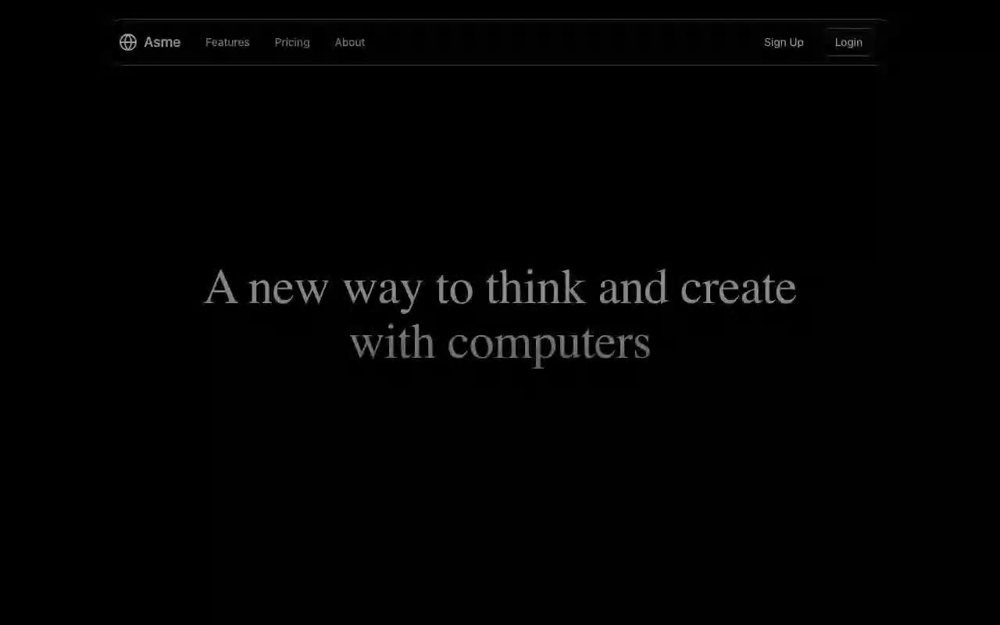

# Asme — Cinematic Dark Hero Landing Page (React 19 + Vite + Tailwind CSS v4 + Motion)

[](./demo.mp4)

Full-screen, single-viewport (100vh, no scroll) dark hero landing page for **Asme**, a fictional no-code AI app platform. The fullscreen background is an HLS video stream from Mux, playing natively on Safari and via hls.js MediaSource on other browsers. A liquid-glass pill navbar (luminosity-blended glass with a masked `::before` gradient border) floats above an Instrument Serif hero heading and an animated email-capture CTA — "Get early access" expands to a form with a 60 ms/char typewriter placeholder, flips `ArrowRight` to `Check` on submit, and auto-resets after 4 seconds. All elements animate in on load with Motion (Framer Motion). Generated with Claude Fable 5.

## Run

```sh
npm install
npm run dev      # dev server
npm run build    # production build
npm run preview  # serve dist/
```

## Verified

- `npm run build` — clean production build
- Headless Chromium (Playwright, CLI-driven): heading/tagline/nav copy, Instrument Serif + Inter computed fonts, `backdrop-filter: blur(4px)` applied, no page scroll, video playing (`readyState=4`) on **both** the native-HLS and hls.js branches, autofocus, both typewriter placeholders character-perfect, Check-icon state, 4 s reset to button, zero console/page errors

---

Part of the [Landing pages](../) collection in the [claude-directory](../../) — an open-source gallery of AI-generated UI built with Claude Fable 5. [Browse the live gallery](https://pulkitxm.com/claude-directory).
