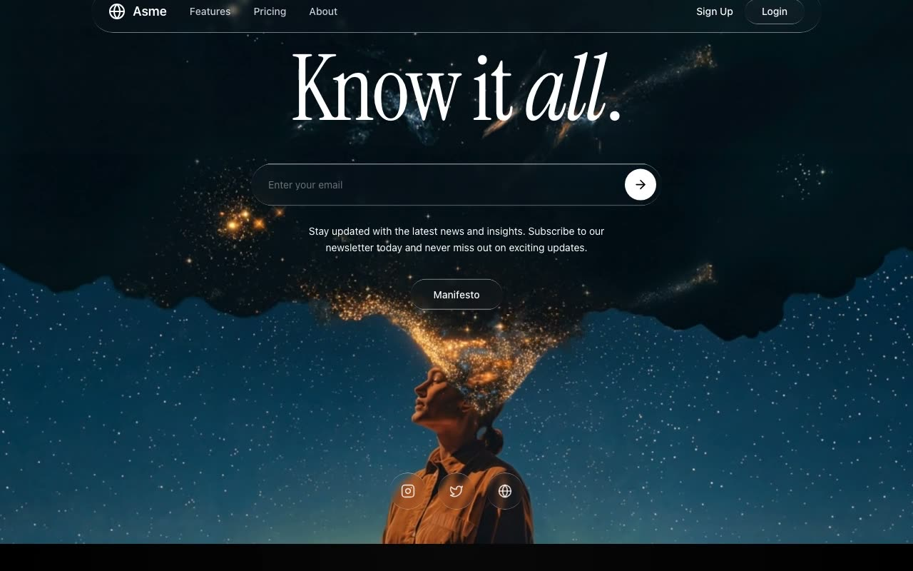

# Asme — Liquid Glass Dark Landing Page (React + TypeScript + Vite + Tailwind CSS + Framer Motion)

[](./demo.mp4)

A pixel-spec, dark-themed single-page marketing landing site for **Asme**, a fictional knowledge and insights platform, featuring a signature reusable `.liquid-glass` surface treatment — luminosity-blended translucent fill, 4px backdrop blur, inset top highlight, and a masked `::before` gradient border — applied consistently across the navbar pill, email capture, buttons, cards, and icon chips. The full-viewport hero loops a locally vendored `.mp4` video via a vanilla `requestAnimationFrame` opacity crossfade (fade in on `canplay`, fade out at 0.55s remaining, 100ms gap restart). Four scroll-triggered sections animate in with Framer Motion `useInView`: About, Featured Video, Innovation × Vision (video + two columns sliding from opposite sides), and Services (two glass cards with hover-zoom video). Instrument Serif display type sits against pure black throughout. Generated with Claude Fable 5.

## Highlights

- **Liquid glass UI** — a reusable `.liquid-glass` class (luminosity-blended translucent fill,
  4px backdrop blur, inset top highlight, and a masked `::before` gradient border that fades
  through the middle) used on the navbar pill, email capture, buttons, cards, and icon chips.
- **Instrument Serif** display type (regular + italic) against the system sans, all on pure black.
- **Seamless hero video loop** — vanilla rAF opacity animation via refs: fade in on `canplay`,
  fade out when ≤ 0.55s remain, brief black hold on `ended`, then restart and fade back in.
- **Scroll-triggered reveals** — every section animates in once via framer-motion `useInView`
  with a `-100px` margin (About, Featured Video, Innovation x Vision, Services).

## Sections

1. **Hero** — full-viewport background video, glass navbar, "Know it *all*." headline,
   email capture pill, manifesto button, social icon footer.
2. **About** — sans/serif-italic mixed headline with radial-gradient atmosphere.
3. **Featured video** — rounded cinematic player with a glass "Our Approach" card overlay.
4. **Innovation x Vision** — video + two divided text blocks sliding in from opposite sides.
5. **What we do** — two glass service cards with hover-zoom video media.

## Run

```bash
npm install
npm run dev       # local dev server
npm run build     # tsc --noEmit + vite build
npm run verify    # headless Playwright checks against vite preview
```

## Verification

`npm run verify` boots `vite preview` programmatically and runs 48 headless-Chromium
assertions: rendered copy of all five sections, all five video URLs and their loop/muted
wiring, Instrument Serif on the headline, `.liquid-glass` computed styles (blur, inset
shadow, `::before` gradient border at 1.4px), scroll-triggered animations settling at
opacity 1, console-error cleanliness, and mobile-viewport visibility rules.

---

Part of the [Landing pages](../) collection in the [claude-directory](../../) — an open-source gallery of AI-generated UI built with Claude Fable 5. [Browse the live gallery](https://pulkitxm.com/claude-directory).
