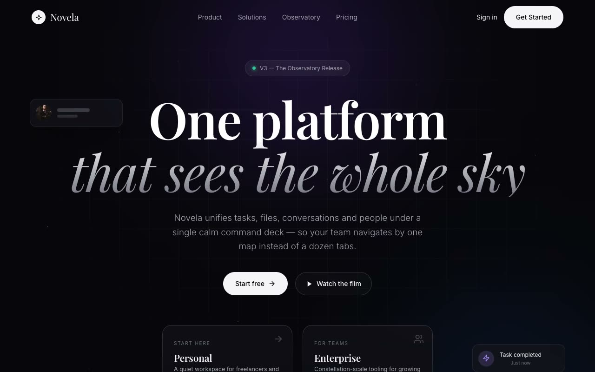

# Astral Veil — Cosmic Nocturne SaaS Landing Page for Novela (HTML, CSS, Vanilla JS)

[](./demo.mp4)

A dark, premium multi-section marketing landing page for a fictional software platform called Novela, built in the "Astral Veil" design language — a near-black cosmic nocturne where soft violet and cobalt nebula glows bleed through a veil of frosted glass. Editorial Playfair Display serif headlines sit inside a calm engineering grid, punctuated by glassmorphic cards, a twinkling CSS starfield, drifting UI fragments, an infinite trust marquee, and a floating constellation of integration capsules. Generated with Claude Fable 5.

## Run

Open `index.html` directly, or serve the folder:

```bash
python3 -m http.server 5199
# then visit http://localhost:5199
```

## Highlights

- Layered hero: starfield + masked grid + dual radial glows, staggered entrance.
- Glass entry cards with brightening 1px gradient borders.
- Asymmetric feature bento, 2×2 pure-CSS product mockups, dashed scheduling timeline.
- Constellation of color-coded integration capsules with individual float rhythms.
- Scroll-reveal via IntersectionObserver; honors `prefers-reduced-motion`.

## Stack

HTML, CSS, Vanilla JS

---

Part of the [Landing pages](../) collection in the [claude-directory](../../) — an open-source gallery of AI-generated UI built with Claude Fable 5. [Browse the live gallery](https://pulkitxm.com/claude-directory).
