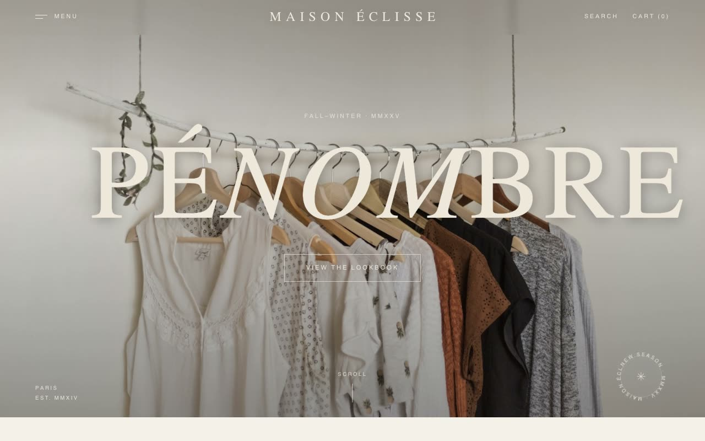

# Atelier Noir — Luxury Fashion House Landing Page for Maison Éclisse (HTML, CSS, Vanilla JS)

[](./demo.mp4)

A quiet, editorial, haute-couture multi-section landing page for a fictional Parisian fashion house named Maison Éclisse, built in the "Atelier Noir" aesthetic — a restrained lookbook on warm bone paper (`#F4F1EA`) where ink type, generous negative space, and hard-edged architecture replace gradients and drop shadows. It reads like a printed campaign monograph that happens to scroll: section numbers, corner index markers, running uppercase metadata in the margins, a slowly rotating circular text badge in the hero, alternating collection diptychs, a staggered product grid, a journal, and a soot-dark footer. Generated with Claude Fable 5.

## Run

This is a static project — open `index.html` in a browser, or serve the folder:

```sh
python3 -m http.server 8000
```

See `prompt.md` for the full build spec; `demo.mp4` shows it in motion.

---

Part of the [Landing pages](../) collection in the [claude-directory](../../) — an open-source gallery of AI-generated UI built with Claude Fable 5. [Browse the live gallery](https://pulkitxm.com/claude-directory).
