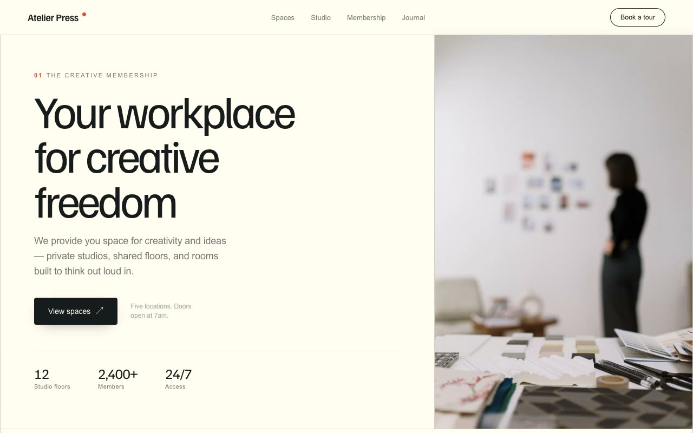

# Atelier Press — Editorial Paper Grid Creative-Workspace Landing Page (HTML, CSS, Vanilla JS)

[](./demo.mp4)

A single-page marketing landing page for a fictional creative-workspace and studio-membership brand called Atelier Press, built in the "Editorial Paper Grid" design language — a print-first aesthetic that feels like a large-format design monograph or an independent architecture magazine that happens to scroll. Everything sits on warm cream paper (`#FFFDF0`), divided by crisp hairline rules into a strict modular grid, with Familjen Grotesk set at massive tight-tracked sizes paired with a neutral system sans for body copy, and a single vermilion-coral accent (`#E64E2A`) used sparingly. Sections include a split editorial hero divided by a vertical hairline, a keyword marquee strip, an indexed spaces grid, a stats band, and hairline-bordered membership pricing cards. Generated with Claude Fable 5.

## Run

This is a static project — open `index.html` in a browser, or serve the folder:

```sh
python3 -m http.server 8000
```

See `prompt.md` for the full build spec; `demo.mp4` shows it in motion.

---

Part of the [Landing pages](../) collection in the [claude-directory](../../) — an open-source gallery of AI-generated UI built with Claude Fable 5. [Browse the live gallery](https://pulkitxm.com/claude-directory).
