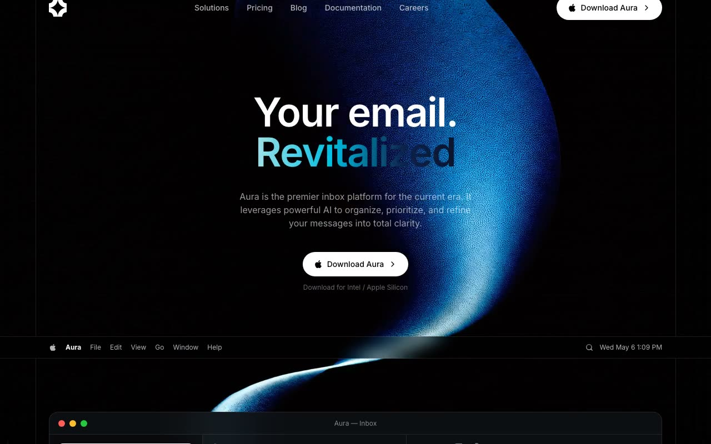

# Aura — AI-Native Email Client Landing Page (React + Vite + Tailwind + Framer Motion)

[](./demo.mp4)

A premium, dark-cinematic landing page for **Aura**, a fictional AI-native email client, featuring a looping fullscreen background video, a gradient-clip shiny headline, a macOS-style menu bar mockup, a realistic inbox preview, and a custom liquid-glass card treatment. The multi-section layout covers navbar, hero, menu bar, inbox mockup, feature triage, logo cloud, testimonials, pricing, and a final CTA — targeting the AI productivity app and SaaS landing page use case. Generated with Claude Fable 5.

## Run

```sh
npm install
npm run dev      # start the dev server
npm run build    # type-check (tsc --noEmit) and build for production
npm run preview  # preview the production build
```

See `prompt.md` for the full build spec; `demo.mp4` shows it in motion.

---

Part of the [Landing pages](../) collection in the [claude-directory](../../) — an open-source gallery of AI-generated UI built with Claude Fable 5. [Browse the live gallery](https://pulkitxm.com/claude-directory).
