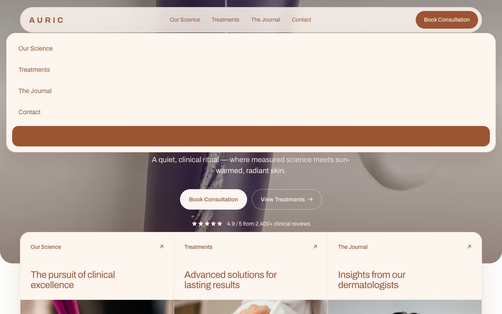

# Auric — High-End Dermaceutical Clinic Landing Page (Vanilla HTML + CSS + JS)

[](./demo.mp4)

A multi-section marketing landing page for **Auric**, a fictional luxury skincare and dermaceutical clinic, built in a "Clinical Warmth" aesthetic — the collision of medical precision with sun-warmed skin. The mood is calm, expensive, and trustworthy — Aesop-meets-dermatology — with warm terracotta-clay accents (`#9F5434`) on cream and white surfaces, a floating pill navbar, a full-bleed editorial hero, an overlapping three-column action-block grid, a value-prop marquee strip, a signature-treatments card grid, a split "Our Science" stats block with count-up animation, a pull-quote testimonial, and a deep-clay CTA band. Generated with Claude Fable 5.

## Run

This is a static project — open `index.html` in a browser, or serve the folder:

```sh
python3 -m http.server 8000
```

See `prompt.md` for the full build spec; `demo.mp4` shows it in motion.

---

Part of the [Landing pages](../) collection in the [claude-directory](../../) — an open-source gallery of AI-generated UI built with Claude Fable 5. [Browse the live gallery](https://pulkitxm.com/claude-directory).
