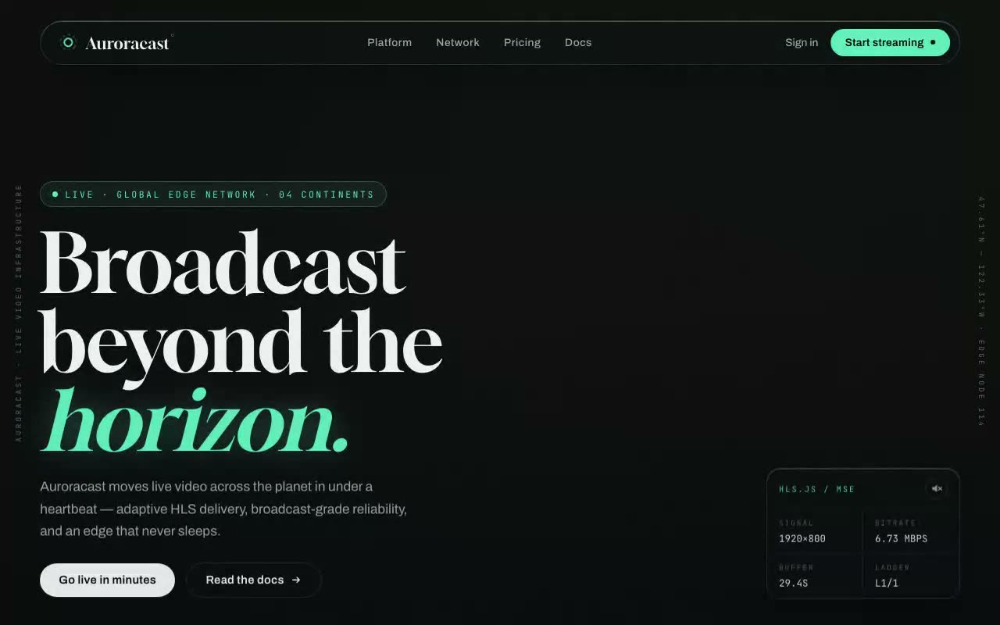

# Auroracast — HLS Video Streaming Landing Page (React + hls.js + Glassmorphism)

[](./demo.mp4)

A modern React landing page for a fictional broadcast-grade live video platform featuring a full-screen adaptive HLS video background, a glassmorphic navigation header, and hero content pinned to the bottom-left corner. Dark cinematic aesthetic with Gloock display serif, Archivo body, JetBrains Mono telemetry labels, and an aurora-green signal accent — ideal as a live streaming platform or video SaaS landing page template. Generated with Claude Fable 5.

## Features

- **Full-screen HLS video background** — `hls.js` with MSE, native HLS
  fallback for Safari, and an ordered fallback chain of public test
  streams. Fades in with a slow scale settle once playback starts.
- **Glassmorphic navigation header** — frosted pill bar
  (`backdrop-filter: blur + saturate`, inset highlight, soft shadow)
  with a working glass mobile drawer (Escape to close).
- **Hero pinned bottom-left** — staggered line-by-line reveal, live
  kicker pill, dual CTAs.
- **Live stream telemetry** — bottom-right glass card showing real
  resolution / bitrate / buffer / ABR-ladder values from hls.js events,
  plus a mute toggle.
- Responsive (desktop / tablet / phone / short-landscape) and honors
  `prefers-reduced-motion`.

## Run

```bash
npm install
npm run dev      # dev server
npm run build    # production build
npm run preview  # serve dist/
```

---

Part of the [Landing pages](../) collection in the [claude-directory](../../) — an open-source gallery of AI-generated UI built with Claude Fable 5. [Browse the live gallery](https://pulkitxm.com/claude-directory).
