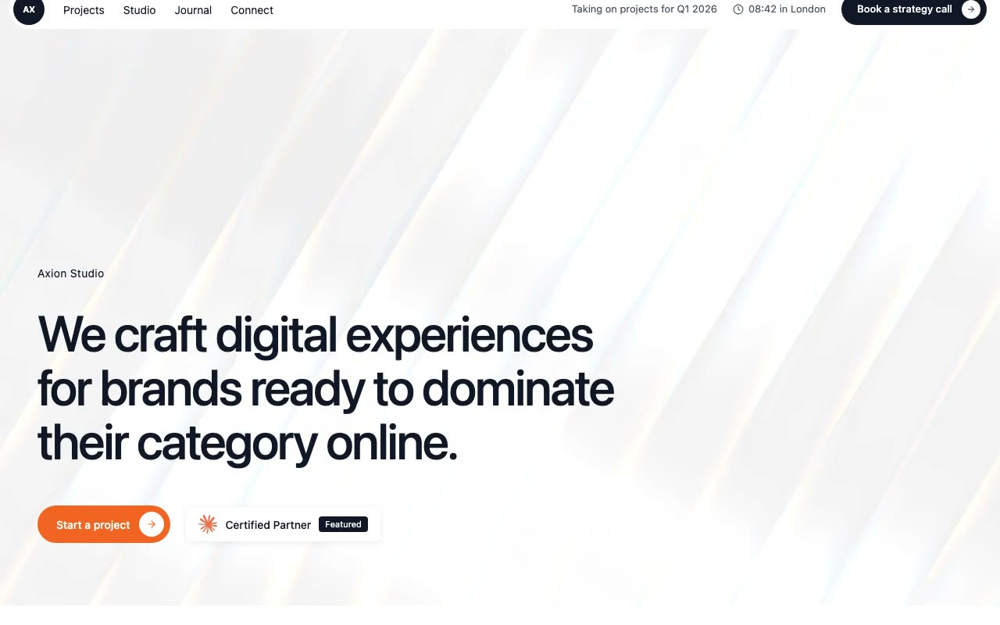

# Axion Studio — Design Agency Landing Page (React + Vite + Tailwind + WebGL Shaders)

[](./demo.mp4)

A single-page landing site for **Axion Studio**, a strategy-led design agency, built with React 18 + TypeScript on Vite and styled with Tailwind CSS. Three stacked sections — a full-viewport animated WebGL shader hero, an "about" section, and a featured case-studies section — make it a strong reference for creative agency landing pages and portfolio sites. The hero background uses an animated shader stack (Swirl, ChromaFlow, FlutedGlass, FilmGrain via the `shaders` package with Pixi.js), complemented by a hover text-roll CTA interaction, a live London wall-clock, a slide-up mobile bottom-sheet menu, and CSS hover-expanding pill buttons over autoplaying case-study video. Generated with Claude Fable 5.

## Run

```sh
npm install
npm run dev      # start the dev server
npm run build    # type-check (tsc -b) and build for production
npm run preview  # preview the production build
npm run verify   # run the Playwright verification script
```

See `prompt.md` for the full build spec; `demo.mp4` shows it in motion.

---

Part of the [Landing pages](../) collection in the [claude-directory](../../) — an open-source gallery of AI-generated UI built with Claude Fable 5. [Browse the live gallery](https://pulkitxm.com/claude-directory).
