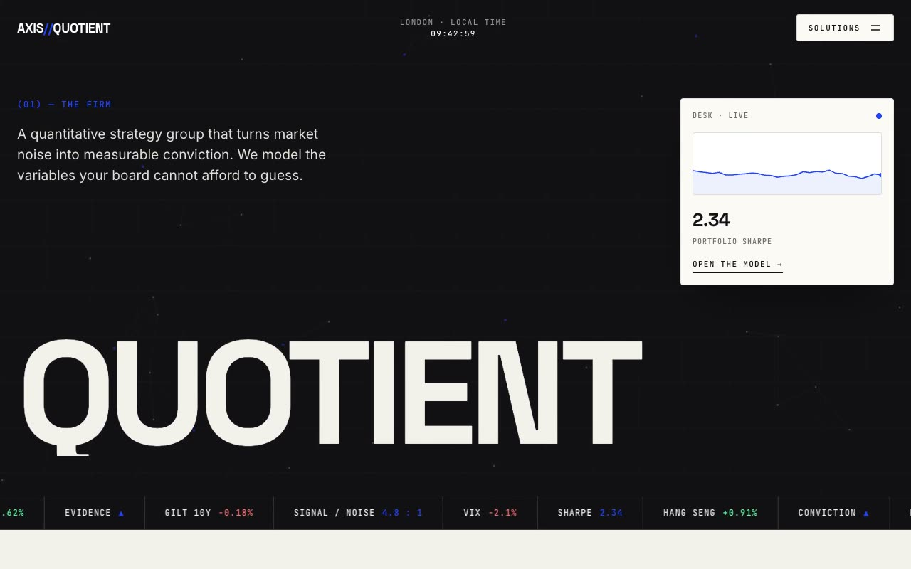

# Axis Quotient — Quantitative Strategy Consultancy Landing Page (Vanilla HTML + CSS + JS)

[](./demo.mp4)

A multi-section marketing landing page for **Axis Quotient**, a fictional quantitative strategy consultancy, built in a "Quant Brutalist Editorial" design language — stark black-ink-on-ivory that reads like a Swiss financial prospectus crossed with a data terminal. An electric cobalt accent (`#1F44FF`) punctuates hairline rules, section index numbers, monospace meta labels, and oversized Space Grotesk display wordmarks across a tight editorial grid. Key features include an animated canvas particle/grid hero with a lifted ivory ticker card (animated SVG sparkline, rotating metric), a capabilities accordion, count-up metrics band, engagement-model pricing cards with live toggles, a marquee ticker strip, and a massive cobalt CTA — ideal for fintech, consultancy, or data-science landing pages. Generated with Claude Fable 5.

## Run

This is a static project — open `index.html` in a browser, or serve the folder:

```sh
python3 -m http.server 8000
```

See `prompt.md` for the full build spec; `demo.mp4` shows it in motion.

---

Part of the [Landing pages](../) collection in the [claude-directory](../../) — an open-source gallery of AI-generated UI built with Claude Fable 5. [Browse the live gallery](https://pulkitxm.com/claude-directory).
