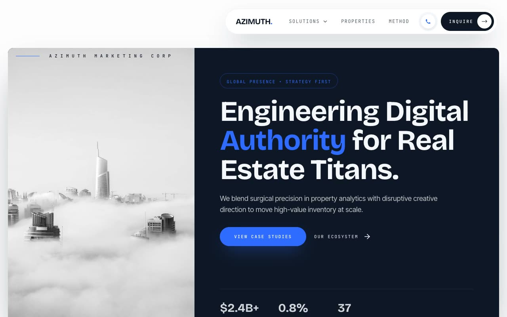

# Azimuth — Real Estate Marketing Agency Landing Page (Vanilla HTML + CSS + JS)

[](./demo.mp4)

A multi-section marketing landing page for **Azimuth**, a fictional real-estate marketing and growth agency, built in a "High-Altitude Precision" design language — a midnight mission-control deck crossed with a luxury architecture prospectus. A deep navy void (`#0E1726`), a single electric-cobalt accent (`#2F6BFF`), Bricolage Grotesque display type, Inter Tight body, JetBrains Mono labels, and Playfair Display italic accents create an engineered, premium feel. Features include a floating pill navbar with a wide mega-menu, a 38/62 split hero with a grayscale-to-color building image, an ecosystem bento grid, a horizontally scrollable portfolio of property cards, a cobalt "method" bento section, and a stacked-card final CTA with fanning scroll animation — ideal as a real estate, property, or luxury brand landing page. Generated with Claude Fable 5.

## Run

This is a static project — open `index.html` in a browser, or serve the folder:

```sh
python3 -m http.server 8000
```

See `prompt.md` for the full build spec; `demo.mp4` shows it in motion.

---

Part of the [Landing pages](../) collection in the [claude-directory](../../) — an open-source gallery of AI-generated UI built with Claude Fable 5. [Browse the live gallery](https://pulkitxm.com/claude-directory).
