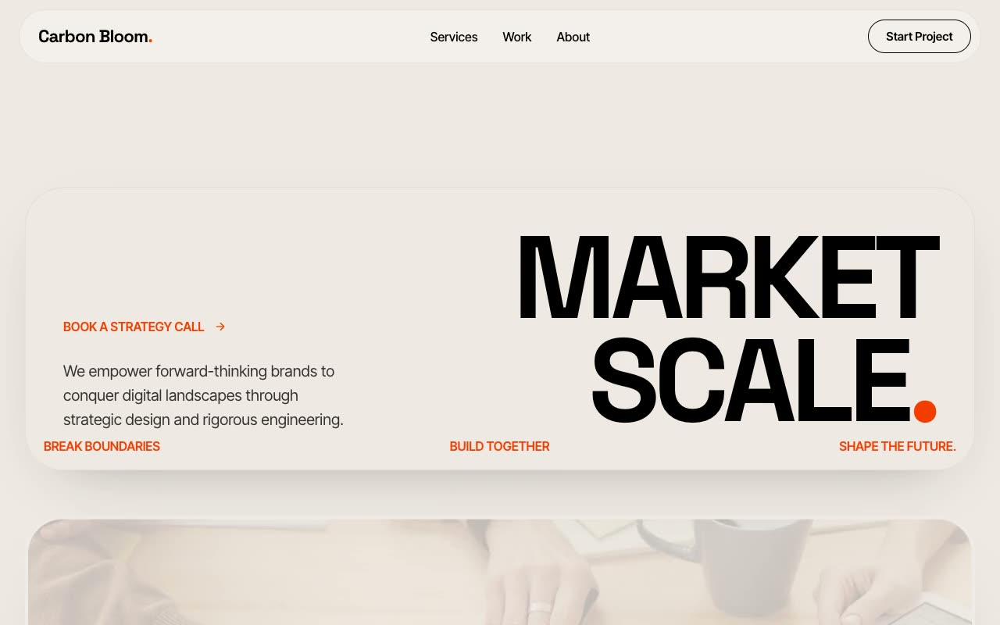

# Carbon Bloom — Creative Agency Landing Page (Vanilla HTML + CSS + JS, Molten Paper)

[](./demo.mp4)

A multi-section marketing landing page for **Carbon Bloom**, a fictional independent design-and-engineering agency, built in a "Molten Paper" design language — warm, tactile, and editorial on a soft bone-beige canvas (`#EEE9E3`), anchored by ink-black and detonated by a single molten-orange accent (`#F43C00`). Blocks swap between beige, pure-black, and pure-white as you scroll, each curling over the previous with a large rounded top edge like stacked sheets of paper. Space Grotesk display type (up to ~150px uppercase) pairs with Inter Tight body; sticky-stack panels, two infinite marquees, a philosophy statement, a single-open FAQ accordion, and a masonry featured-work grid round out the layout — a strong reference for creative agency, portfolio, and editorial landing pages. Generated with Claude Fable 5.

## Run

This is a static project — open `index.html` in a browser, or serve the folder:

```sh
python3 -m http.server 8000
```

See `prompt.md` for the full build spec; `demo.mp4` shows it in motion.

---

Part of the [Landing pages](../) collection in the [claude-directory](../../) — an open-source gallery of AI-generated UI built with Claude Fable 5. [Browse the live gallery](https://pulkitxm.com/claude-directory).
