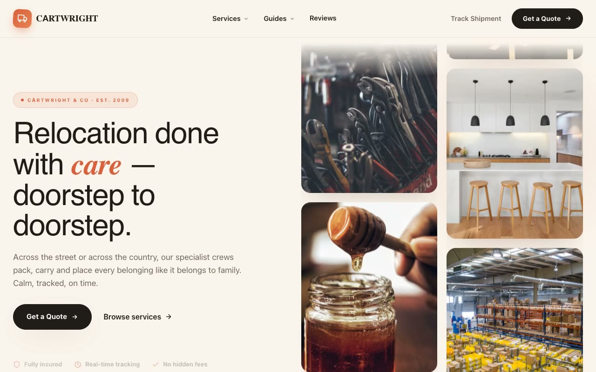

# Cartwright & Co — Premium Relocation & Logistics Landing Page (Vanilla HTML + CSS + JS)

[](./demo.mp4)

A multi-section marketing landing page for **Cartwright & Co**, a fictional premium craft-led relocation and logistics company, built in a "Warm Artisan Logistics" aesthetic — a soft, editorial take that feels like a boutique hospitality brand rather than a freight warehouse. Terracotta clay (`#D9603B`), cream paper, generous whitespace, rounded geometry, and one Fraunces italic serif accent word per headline convey careful craftsmanship. The layout includes a sticky glass navbar with a services mega-menu, a two-column hero with opposing vertical image ticker columns, a partner marquee, soft service cards, a dark stats band with count-up figures, a 3-step process timeline that fills on scroll, an auto-cycling stacked testimonial deck, and a split contact/quote panel with inline success state — ideal as a moving company, logistics, or premium services landing page. Generated with Claude Fable 5.

## Run

This is a static project — open `index.html` in a browser, or serve the folder:

```sh
python3 -m http.server 8000
```

See `prompt.md` for the full build spec; `demo.mp4` shows it in motion.

---

Part of the [Landing pages](../) collection in the [claude-directory](../../) — an open-source gallery of AI-generated UI built with Claude Fable 5. [Browse the live gallery](https://pulkitxm.com/claude-directory).
