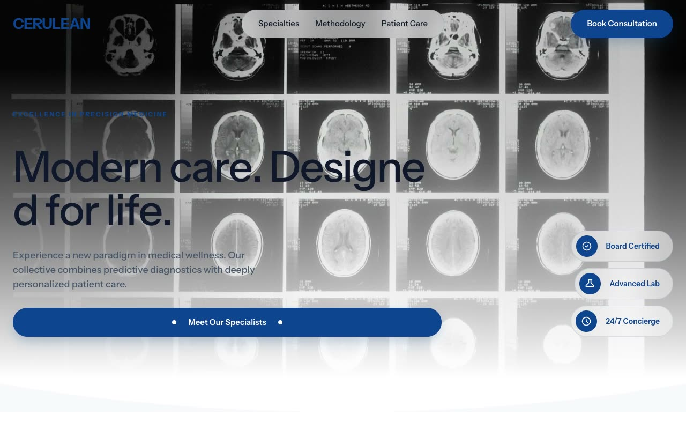

# Cerulean — Precision Medicine Clinic Landing Page (Vanilla HTML + CSS + JS)

[](./demo.mp4)

A multi-section landing page for **Cerulean**, a fictional high-end precision-medicine clinic, built in a "Clinical Serenity" aesthetic — the collision of cool, instrument-grade medical precision with airy, glass-like calm. The page sits almost entirely on white, anchored by a deep medical blue (`#0F4490`) and lifted by a soft teal, with a black-bordered, marquee-headed "Request Invitation" form card that breaks the softness with editorial brutalism. Built as a fully self-contained static site with no dependencies or build step required. Generated with Claude Fable 5.

## Run

This is a static project — open `index.html` in a browser, or serve the folder:

```sh
python3 -m http.server 8000
```

See `prompt.md` for the full build spec; `demo.mp4` shows it in motion.

---

Part of the [Landing pages](../) collection in the [claude-directory](../../) — an open-source gallery of AI-generated UI built with Claude Fable 5. [Browse the live gallery](https://pulkitxm.com/claude-directory).
