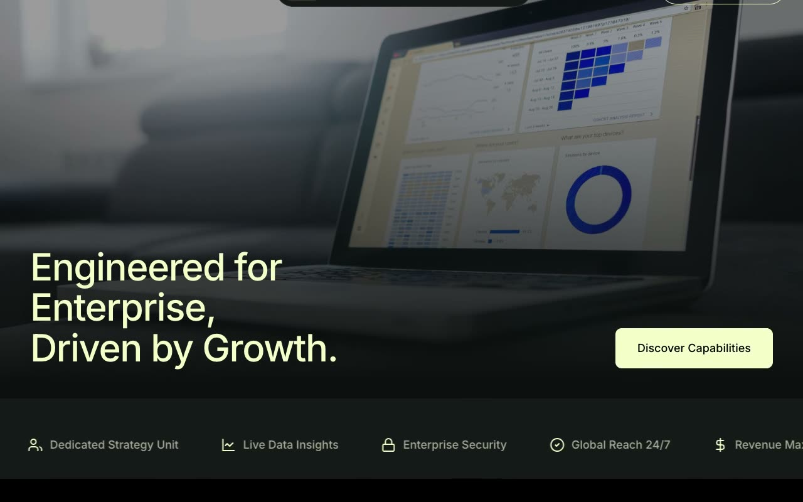

# Citron Atlas — Enterprise Growth-Advisory Landing Page (Vanilla HTML + CSS + JS)

[](./demo.mp4)

A multi-section landing page for **Meridian & Voss**, a fictional enterprise growth-advisory firm, built in a "Phosphor Olive" design language — a deep, near-black boardroom aesthetic lit by a single phosphorescent citron-lime accent (`#F3FFC9`). The mood is quiet, authoritative, and moneyed: charcoal and olive-ink surfaces with one restrained accent doing all the talking. The page runs deep — a dimmed-photo hero with a capability-pill marquee, a clients strip, an industries snap-scroll slider, a three-card "why us" grid, a cross-fading services accordion, count-up statistics, a case-studies slider with friction/intervention pairs, a staggered methodology step layout, and a two-panel footer. Hand-written CSS with custom-property tokens, no framework. Generated with Claude Fable 5.

## Run

This is a static project — open `index.html` in a browser, or serve the folder:

```sh
python3 -m http.server 8000
```

See `prompt.md` for the full build spec; `demo.mp4` shows it in motion.

---

Part of the [Landing pages](../) collection in the [claude-directory](../../) — an open-source gallery of AI-generated UI built with Claude Fable 5. [Browse the live gallery](https://pulkitxm.com/claude-directory).
