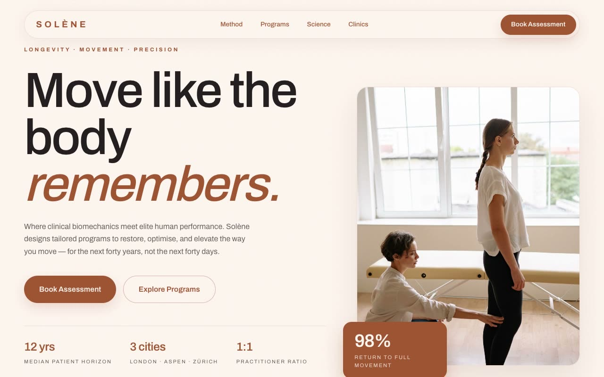

# Solène — Longevity & Precision-Movement Clinic Landing Page (Vanilla HTML + CSS + JS)

[](./demo.mp4)

A single-page landing site for **Solène**, a fictional high-end longevity and precision-movement clinic, built in a "Warm Clay Editorial" aesthetic — a calm, sun-washed, architectural luxury-wellness language built on terracotta (`#9F5434`) and cream. The page feels like a Mediterranean plaster villa crossed with a clinical performance lab: quiet, expensive, precise, and human, predominantly cream and clay with one dramatic ink-dark section for contrast. Sections include a floating pill nav, an asymmetric editorial split hero with an overlapping stat card, a disciplines marquee, an overlapping action-block method grid, a zig philosophy block, a four-column programs grid with grayscale-to-color images, a dark sticky science band, and a clay footer. Motion uses word-by-word heading reveals, directional scroll reveals, image hovers, and a custom clay scrollbar, all respecting `prefers-reduced-motion`. Generated with Claude Fable 5.

## Run

This is a static project — open `index.html` in a browser, or serve the folder:

```sh
python3 -m http.server 8000
```

See `prompt.md` for the full build spec; `demo.mp4` shows it in motion.

---

Part of the [Landing pages](../) collection in the [claude-directory](../../) — an open-source gallery of AI-generated UI built with Claude Fable 5. [Browse the live gallery](https://pulkitxm.com/claude-directory).
