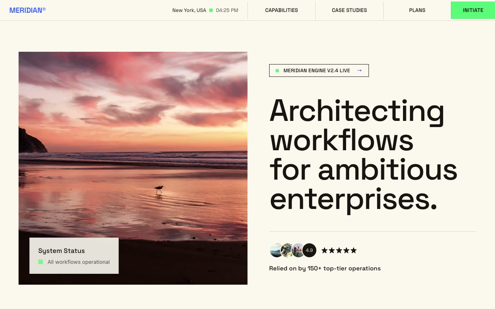

# Cobalt Repairworks — Electronics Repair Studio Landing Page (Vanilla HTML + CSS + JS)

[](./demo.mp4)

A single-page, forced-light landing page for **Repairworks**, a fictional neighborhood electronics repair studio, built in a "Workbench Editorial" aesthetic — a warm paper-cream canvas (`RGB(242, 241, 237)`), a single confident cobalt-blue accent (`RGB(22, 103, 217)`), generous whitespace, and a calm, reliable, trade-confident mood. The signature structural device is a 3.5px solid cobalt square glyph used consistently as the logo mark, eyebrow bullet, and metadata tick. Type pairs Host Grotesk (tight neo-grotesque, huge hero) with IBM Plex Mono for uppercase labels and spec ticks. Sections include a sticky blurred header, a hero with a "what we fix" device-card grid, a trusted-brands marquee, a two-up services grid with mono spec ticks and pricing, a six-block benefits grid, an about split, alternating testimonial cards, a two-column FAQ, and a final CTA panel. Generated with Claude Fable 5.

## Run

This is a static project — open `index.html` in a browser, or serve the folder:

```sh
python3 -m http.server 8000
```

See `prompt.md` for the full build spec; `demo.mp4` shows it in motion.

---

Part of the [Landing pages](../) collection in the [claude-directory](../../) — an open-source gallery of AI-generated UI built with Claude Fable 5. [Browse the live gallery](https://pulkitxm.com/claude-directory).
