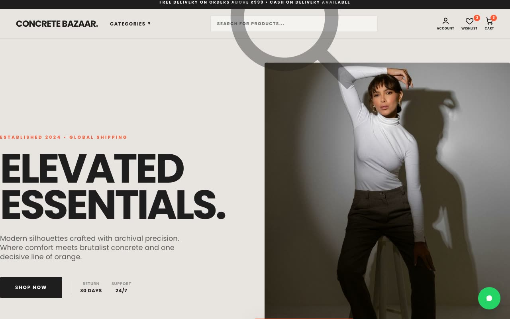

# Concrete Bazaar — Indian Fashion & Lifestyle Storefront Landing Page (Vanilla HTML + CSS + JS)

[](./demo.mp4)

A multi-section marketing and storefront landing page for **Concrete Bazaar**, a fictional direct-to-consumer Indian fashion and lifestyle label, built in a "Brutalist Retail Editorial" design language — the collision of a raw concrete-and-ink brutalist poster with the loud, conversion-hungry energy of a modern Indian shopping app. Everything sits on a warm concrete-beige canvas (`RGB(232, 229, 226)`), anchored by near-black ink, with a single vermilion-orange accent (`#FE5733`), speaking COD, UPI, bank offers, and WhatsApp support. Near-zero border radius, hard hairline borders, and scrolling marquees define the look. Sections include a promo bar, a sticky nav with search and category dropdown, a two-column hero, a bestsellers grid with working add-to-cart (increments the nav badge), an offers banner, a festive orange campaign, a pincode checker with inline validation, reviews, and a floating WhatsApp FAB. Generated with Claude Fable 5.

## Run

This is a static project — open `index.html` in a browser, or serve the folder:

```sh
python3 -m http.server 8000
```

See `prompt.md` for the full build spec; `demo.mp4` shows it in motion.

---

Part of the [Landing pages](../) collection in the [claude-directory](../../) — an open-source gallery of AI-generated UI built with Claude Fable 5. [Browse the live gallery](https://pulkitxm.com/claude-directory).
