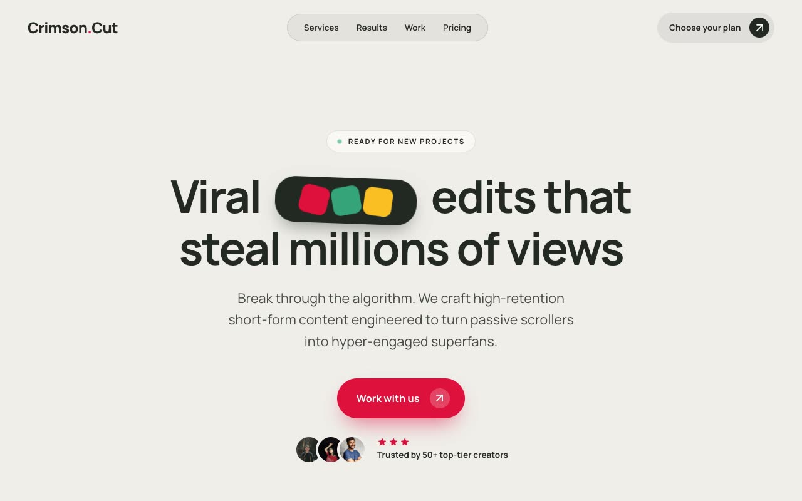

# Crimson Cut — Short-Form Video Editing Studio Landing Page (Vanilla HTML + CSS + JS)

[](./demo.mp4)

A multi-section landing page for **Crimson Cut**, a fictional premium short-form video-editing studio, built in a "Warm-Paper Viral Studio" design language — a confident, editorial agency-portfolio aesthetic on a warm off-white paper canvas (`#EFEEEA`), anchored by a near-black pine-ink and detonated by a single loud crimson-red accent (`#DE103C`). Premium but creator-native, the design speaks the language of TikTok, Reels, and Shorts, with rounded portrait video cards and playful rotated "sticker" accents. Sections alternate paper, white, and pine-ink panels: a floating pill header, a centered hero with an inline rotated palette "sticker" badge, three staggered 9:16 video cards (grayscale-to-color on hover), a 2×2 expertise grid, a dark results bento, case studies, an exclusive FAQ accordion, three-tier pricing, and a right-to-left testimonial marquee. Hand-authored CSS, no external JS libraries. Generated with Claude Fable 5.

## Run

This is a static project — open `index.html` in a browser, or serve the folder:

```sh
python3 -m http.server 8000
```

See `prompt.md` for the full build spec; `demo.mp4` shows it in motion.

---

Part of the [Landing pages](../) collection in the [claude-directory](../../) — an open-source gallery of AI-generated UI built with Claude Fable 5. [Browse the live gallery](https://pulkitxm.com/claude-directory).
