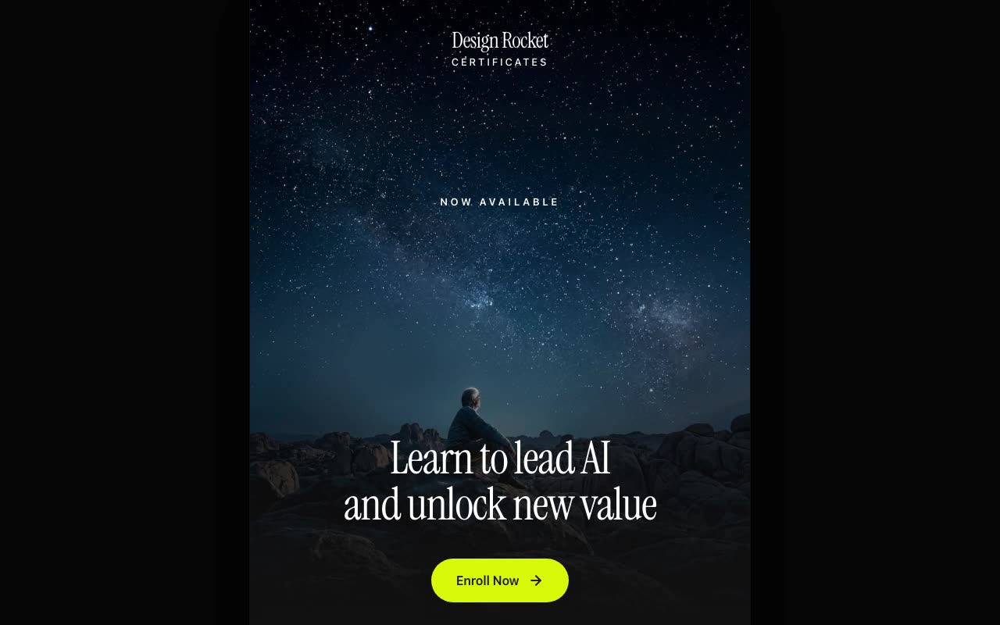

# Design Rocket Certificates — Email-Style Marketing Page (React + Vite + Tailwind CSS)

[](./demo.mp4)

A single-page app that renders an email-style marketing page for the **Design Rocket Certificates** AI leadership course (built in collaboration with Microsoft). Laid out as a narrow 640px email container on a dark background, featuring a video hero, intro copy, two content sections (each pairing a looping video with copy and a CTA), a lime call-to-action card, and a footer with social icons and legal links. Built with React 18 + TypeScript on Vite, styled with Tailwind CSS, with Lucide icons and auto-playing muted looped `<video>` backgrounds. Generated with Claude Fable 5.

## Run

```sh
npm install
npm run dev      # start the dev server
npm run build    # type-check (tsc) and build for production
npm run preview  # preview the production build
```

See `prompt.md` for the full build spec; `demo.mp4` shows it in motion.

---

Part of the [Landing pages](../) collection in the [claude-directory](../../) — an open-source gallery of AI-generated UI built with Claude Fable 5. [Browse the live gallery](https://pulkitxm.com/claude-directory).
