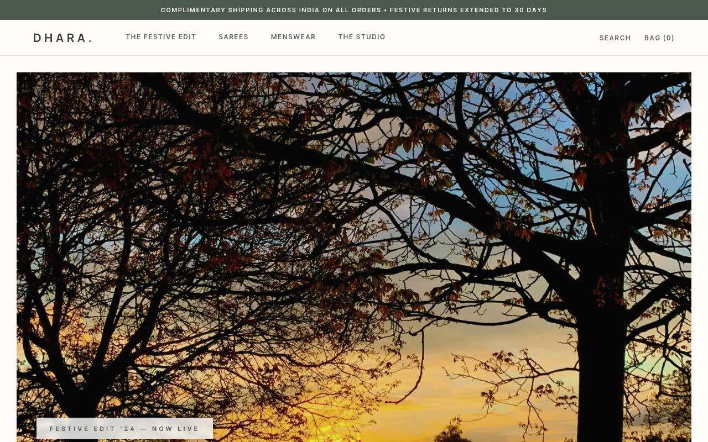

# Dhara — Modern Indian Heritage Fashion Landing Page (Vanilla HTML + CSS + JS)

[](./demo.mp4)

A multi-section marketing and commerce landing page for **Dhara**, a fictional modern-Indian heritage fashion label, built in a "Soft Heritage Edit" design language — a quiet, gallery-like storefront that feels like a printed lookbook for a contemporary artisanal label rather than a crowded e-commerce grid. Soft dusty-pastel color blocks (dusty rose, bone cream, mauve), a deep pine-green structural ink (`#4B594D`), and a single warm antique-gold accent (`#C5A059`) used sparingly. Everything is flat, matte, and mostly hard-edged in a crisp color-block masonry grid. Sections include a pine-green utility bar, a sticky header, a color-block masonry hero with an auto-fading 3-image slideshow, a category showcase, an 8-product "weekly edit" grid with sliding quick-add bars, a payments panel, a pine-green membership panel, an artisan spotlight, value-prop blocks, and a four-column footer. Generated with Claude Fable 5.

## Run

This is a static project — open `index.html` in a browser, or serve the folder:

```sh
python3 -m http.server 8000
```

See `prompt.md` for the full build spec; `demo.mp4` shows it in motion.

---

Part of the [Landing pages](../) collection in the [claude-directory](../../) — an open-source gallery of AI-generated UI built with Claude Fable 5. [Browse the live gallery](https://pulkitxm.com/claude-directory).
