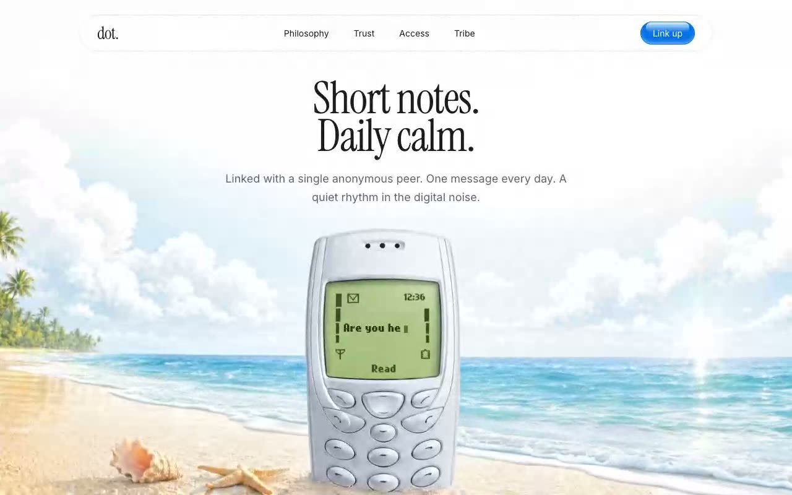

# dot. — Daily Calm Landing Page (React 19 + Vite + Tailwind CSS v4 + Motion)

[](./demo.mp4)

A single-screen marketing landing page for "dot.", a calm-messaging product that links you with one anonymous peer for a single message each day. The hero is a full-screen looping background video of a phone, fronted by an animated Instrument Serif headline and a typewriter effect that types and deletes short messages ("Are you here?", "Yes, I am.", "Speak soon.") positioned to sit on the phone's on-screen display — evoking a quiet, analog rhythm. A floating pill navbar with a glinting "Link up" CTA completes the single-screen composition. Generated with Claude Fable 5.

The typewriter is driven by `useState` + `setTimeout` inside a single `useEffect`, with a blinking cursor animated via Motion. The on-screen text uses a self-hosted "Nokia Cellphone FC Small" font; headlines use Instrument Serif and the UI uses Inter. A floating pill navbar with a glinting "Link up" CTA sits over the video.

Built with React 19 + TypeScript on Vite, Tailwind CSS v4 (via `@tailwindcss/vite`), and Motion (`motion/react`).

## Run

```sh
npm install
npm run dev      # start the Vite dev server
npm run build    # tsc && vite build
npm run preview  # preview the production build
```

See `prompt.md` for the full build spec; `demo.mp4` shows it in motion.

---

Part of the [Landing pages](../) collection in the [claude-directory](../../) — an open-source gallery of AI-generated UI built with Claude Fable 5. [Browse the live gallery](https://pulkitxm.com/claude-directory).
