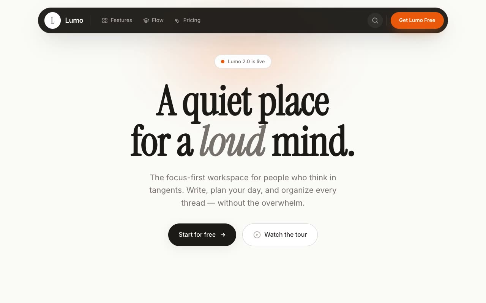

# Ember Quietude — Calm Productivity App Landing Page (Vanilla HTML + CSS + JS)

[](./demo.mp4)

A full, multi-section marketing landing page for a fictional focus-first productivity app called Lumo — "a quiet place for a loud mind." The design language is Ember Quietude: a warm, paper-calm editorial aesthetic with an ember-orange accent, generous whitespace, and a large italic Instrument Serif display typeface — the antithesis of a cold neon SaaS dashboard. The page features a hand-built product dashboard mockup (pure HTML/CSS), a pricing section with a monthly/annual toggle, IntersectionObserver scroll-reveals, and full `prefers-reduced-motion` support. Generated with Claude Fable 5.

The page runs from a floating dark pill navbar (with a hover-revealed glass mega-menu) through a hero with a hand-built product dashboard mockup — browser chrome, sidebar, a dark focus-timer card with a shimmering progress bar, and a floating "AI briefing" card — into feature, planning bento, pricing (with a monthly/annual toggle), a dark final-CTA banner, and footer. All product imagery is constructed in HTML/CSS (no screenshots). Motion includes IntersectionObserver scroll-reveals, a 6s float keyframe, count-up-free interactions, and a back-to-top button, all respecting `prefers-reduced-motion`.

Typography pairs Instrument Serif and Inter, both vendored locally as WOFF2.

## Run

This is a static project — open `index.html` in a browser, or serve the folder:

```sh
python3 -m http.server 8000
```

See `prompt.md` for the full build spec; `demo.mp4` shows it in motion.

---

Part of the [Landing pages](../) collection in the [claude-directory](../../) — an open-source gallery of AI-generated UI built with Claude Fable 5. [Browse the live gallery](https://pulkitxm.com/claude-directory).
