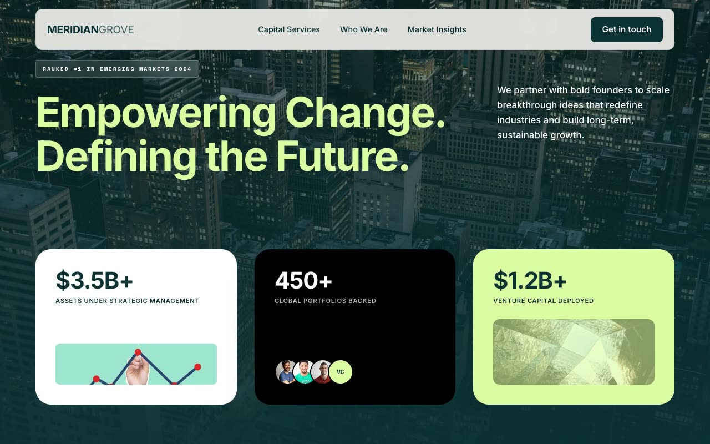

# Evergreen Ledger — Venture Capital Landing Page (Vanilla HTML + CSS + JS)

[](./demo.mp4)

A full, multi-section, responsive landing page for a fictional venture and growth capital firm named Meridian Grove — "empowering change. defining the future." The Evergreen Ledger design language delivers a quiet, institutional-editorial aesthetic — like a private-bank prospectus on warm bone paper — anchored by deep pine/teal ink and a single luminous citron-lime accent. The result reads as confident, moneyed, and restrained: perfect for a VC firm landing page that earns trust through whitespace and typographic discipline. Generated with Claude Fable 5.

Sections run from a floating blurred nav through a full-viewport pine hero with an overlapping 3-up stat-card grid, a sticky "deck of cards" services stack, tilted ethos cards (desktop only, to avoid mobile overflow), an image band, an insights article grid, a final CTA, and a footer with a newsletter form. Motion is hand-written vanilla JS: IntersectionObserver scroll reveals with directional and staggered variants, the sticky service stack, hover image scaling, and a header that compacts past 50px — all respecting `prefers-reduced-motion`.

Typography pairs Inter with Space Mono for mono labels. Hand-written CSS with custom properties for the palette; fonts and photography vendored locally.

## Run

This is a static project — open `index.html` in a browser, or serve the folder:

```sh
python3 -m http.server 8000
```

See `prompt.md` for the full build spec; `demo.mp4` shows it in motion.

---

Part of the [Landing pages](../) collection in the [claude-directory](../../) — an open-source gallery of AI-generated UI built with Claude Fable 5. [Browse the live gallery](https://pulkitxm.com/claude-directory).
