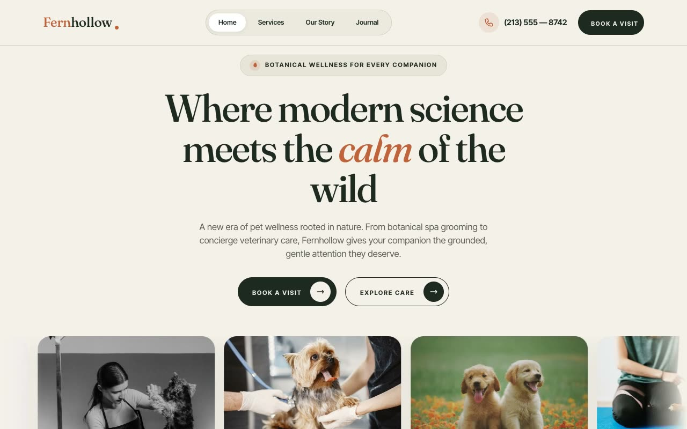

# Fernhollow — Forest Apothecary Pet Wellness Landing Page (Vanilla HTML + CSS + JS)

[](./demo.mp4)

A full, multi-section, responsive landing page for a fictional high-end pet wellness brand named Fernhollow — "where modern veterinary science meets the calm of the wild." The Forest Apothecary aesthetic combines deep fern green, warm clay/terracotta accents, a bone-cream canvas, and large 40px rounded panels to create a boutique wellness brand landing page that reads as calm, clinical-but-warm, and luxurious — part Nordic veterinary clinic, part herbal apothecary. Generated with Claude Fable 5.

The page spans a sticky navbar, a centered hero with a full-bleed auto-scrolling image marquee, an about section with animated count-up stats, a showreel video panel, split service cards, a dark process section, an apothecary product grid, a single-open FAQ accordion, a newsletter CTA with a success state, a journal grid, and a footer. Motion is vanilla JS: IntersectionObserver reveals, count-up stat counters, the hover-pausing marquee, vertical text-swap buttons, and grayscale-to-color image hovers, respecting `prefers-reduced-motion`.

Built as plain HTML + `styles.css` + `main.js`, with fonts, images, and any video vendored locally.

## Run

This is a static project — open `index.html` in a browser, or serve the folder:

```sh
python3 -m http.server 8000
```

See `prompt.md` for the full build spec; `demo.mp4` shows it in motion.

---

Part of the [Landing pages](../) collection in the [claude-directory](../../) — an open-source gallery of AI-generated UI built with Claude Fable 5. [Browse the live gallery](https://pulkitxm.com/claude-directory).
