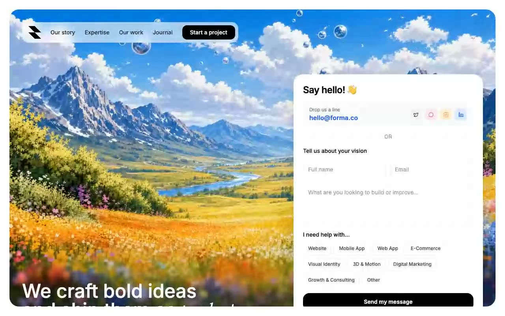

# Forma — Full-Screen Video-Background Landing Page (React 18 + Vite + Tailwind CSS 3)

[](./demo.mp4)

A single-page landing site for a digital product studio called Forma. The page is one large rounded card with a looping full-bleed background video, a glassy `backdrop-blur` pill navbar across the top, a bold headline anchored bottom-left (with one accent word in Instrument Serif italic), and a self-contained contact form card on the bottom-right. It pairs a cinematic video background with a functional multi-select contact form — ideal as a minimal agency or studio landing page. Generated with Claude Fable 5.

The contact form supports multi-select service chips and a fake submit flow: it sets a `sending` state, awaits a one-second delay, then swaps the form for a success state. Sizing is viewport-locked on desktop via `calc()` min-heights and grows to fit content on smaller screens. All motion is Tailwind transitions plus the looping video — no animation library.

Built with React 18 + TypeScript on Vite, Tailwind CSS 3 (with PostCSS + Autoprefixer), and `lucide-react` icons.

## Run

```sh
npm install
npm run dev      # start the Vite dev server
npm run build    # tsc -b && vite build
npm run preview  # preview the production build
```

See `prompt.md` for the full build spec; `demo.mp4` shows it in motion.

---

Part of the [Landing pages](../) collection in the [claude-directory](../../) — an open-source gallery of AI-generated UI built with Claude Fable 5. [Browse the live gallery](https://pulkitxm.com/claude-directory).
