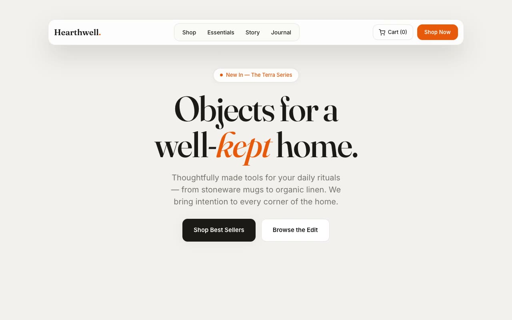

# Freightleaf — Clean Haul Sustainable Freight Landing Page (Vanilla HTML + CSS + JS)

[](./demo.mp4)

A full, multi-section landing page for a fictional sustainable freight and logistics company named Freightleaf. The Clean Haul aesthetic pairs a warm paper-gray canvas with deep charcoal "night highway" panels and a single bio-luminescent lime-green accent — Swiss-adjacent grids and oversized pill shapes that feel engineered and premium without looking greenwashed. Generated with Claude Fable 5.

Sections include a floating pill header (collapsing to a slide-down sheet on mobile), a cinematic charcoal hero with a Ken-Burns background and a continuously floating stat card, a mission band, a sectors grid, a dark technology section with count-up metrics, a hover-pausing testimonial ticker, a final CTA banner, and a footer. Motion is vanilla JS: directional IntersectionObserver reveals, the Ken-Burns scale, a separate inner-wrapper float so it doesn't fight the entry transform, the marquee, and count-up — all respecting `prefers-reduced-motion`.

Typography pairs Instrument Sans (display) with Inter (body). Hand-authored CSS with palette custom properties; all assets vendored locally.

## Run

This is a static project — open `index.html` in a browser, or serve the folder:

```sh
python3 -m http.server 8000
```

See `prompt.md` for the full build spec; `demo.mp4` shows it in motion.

---

Part of the [Landing pages](../) collection in the [claude-directory](../../) — an open-source gallery of AI-generated UI built with Claude Fable 5. [Browse the live gallery](https://pulkitxm.com/claude-directory).
