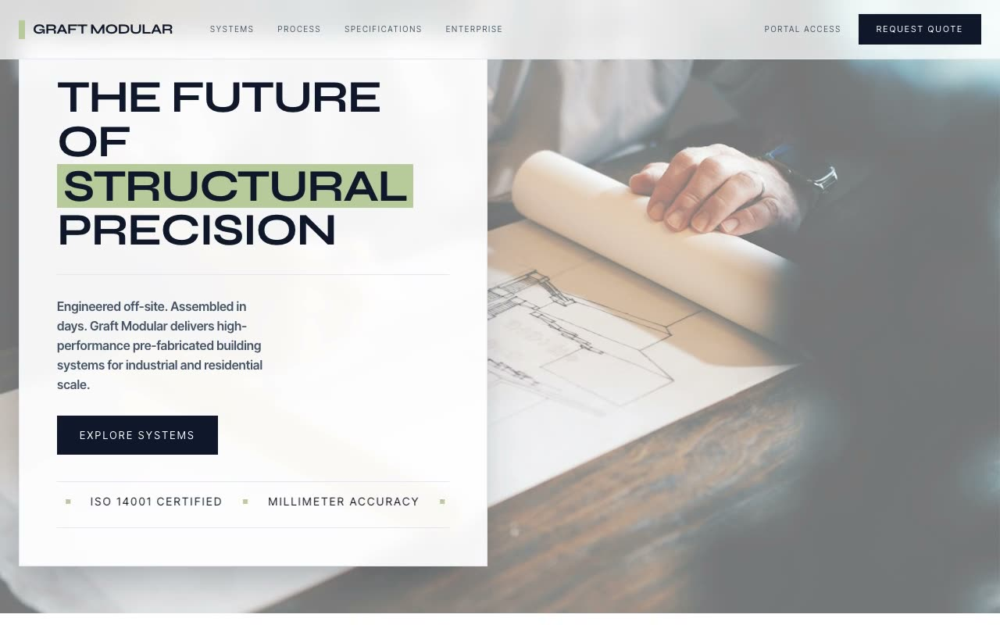

# Graft Modular — Matcha Industrial Prefab Construction Landing Page (Vanilla HTML + CSS + JS)

[](./demo.mp4)

A full, multi-section, responsive landing page for a fictional off-site prefabricated construction systems company named Graft Modular — "precision pre-fabricated building systems, engineered off-site and assembled in days." The Matcha Industrial design language is flat, sharp-cornered (zero border-radius), divided throughout by 1px hairlines, and accented by a single soft matcha-latte green — a precision engineering catalog aesthetic, not a generic SaaS page. Generated with Claude Fable 5.

The page moves from a blurred sticky header through a full-viewport hero (Ken-Burns photo, a sliding info card, a clip-path highlight wipe, and a capability marquee), an edge-to-edge 9-card sub-systems grid, alternating zig-zag specification rows, a count-up stats bar, a "from bit to build" process row, a matcha CTA band with a fake-submit contact form, and a footer. Motion is vanilla JS: a load sequence, the marquee, IntersectionObserver reveals, ease-out-cubic count-ups, and 300–700ms hovers, respecting `prefers-reduced-motion`.

Typography pairs Syne (display) with Inter Tight (body), vendored locally alongside all photography.

## Run

This is a static project — open `index.html` in a browser, or serve the folder:

```sh
python3 -m http.server 8000
```

See `prompt.md` for the full build spec; `demo.mp4` shows it in motion.

---

Part of the [Landing pages](../) collection in the [claude-directory](../../) — an open-source gallery of AI-generated UI built with Claude Fable 5. [Browse the live gallery](https://pulkitxm.com/claude-directory).
