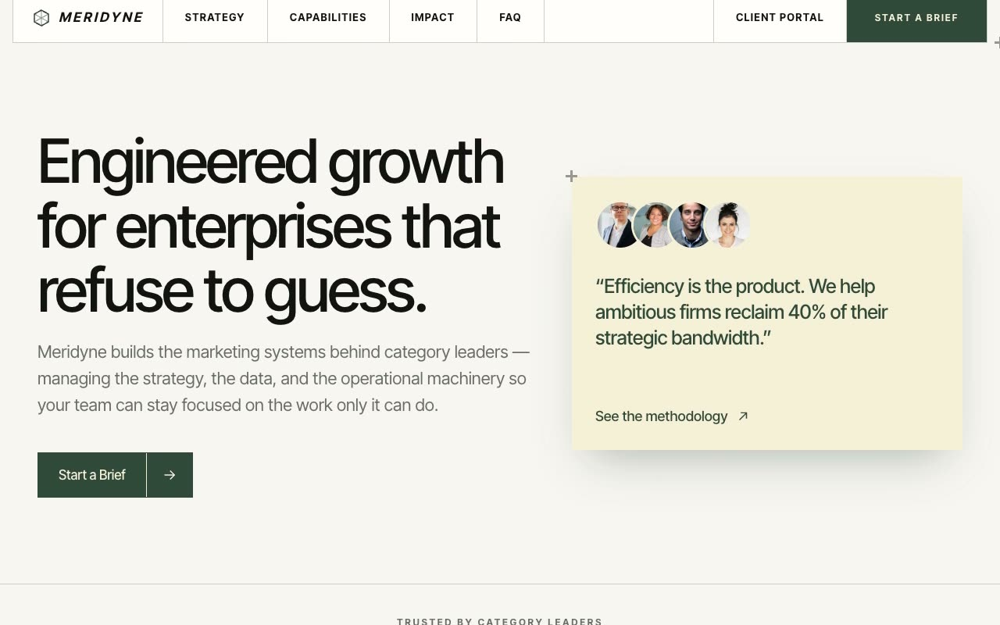

# Meridyne — Precision Grid Studio Growth Agency Landing Page (Vanilla HTML + CSS + JS)

[](./demo.mp4)

A full, multi-section, responsive landing page for a fictional growth-systems studio named Meridyne — "we engineer marketing systems, not campaigns." The Precision Grid Studio design language is calm and architecturally ruled — like a Swiss engineering dossier on warm paper — with every module inside a hairline cell, plus-crosshair registration marks at key frame corners, and forest green used sparingly against butter-cream accents. Generated with Claude Fable 5.

Signature motifs run throughout: the plus crosshairs (turning cream on the green CTA), a hairline cell grid, and a text flip-up hover on nav and menu links. Sections include a celled nav with a hover-driven mega menu, a two-column hero with a cream testimonial card, a logo marquee, a strategy section, a cream capabilities band, a count-up impact stats section, a single-open FAQ, a solid forest-green closing CTA panel, and a footer. Motion is vanilla JS: IntersectionObserver reveals, `requestAnimationFrame` stat count-ups, the flip-up effect, the mega menu, and the marquee.

One typeface throughout — Inter Tight, vendored locally; portraits and images local; icons inline SVG.

## Run

This is a static project — open `index.html` in a browser, or serve the folder:

```sh
python3 -m http.server 8000
```

See `prompt.md` for the full build spec; `demo.mp4` shows it in motion.

---

Part of the [Landing pages](../) collection in the [claude-directory](../../) — an open-source gallery of AI-generated UI built with Claude Fable 5. [Browse the live gallery](https://pulkitxm.com/claude-directory).
