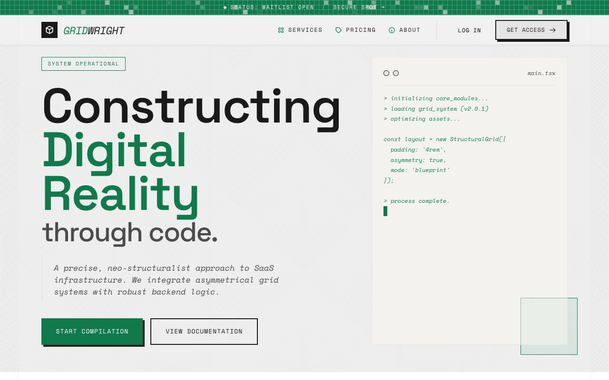

# Gridwright — Neo-Structuralist Blueprint Developer-Infrastructure SaaS Landing Page (HTML, CSS, Vanilla JS)

[](./demo.mp4)

A full, multi-section, responsive marketing landing page for a fictional developer-infrastructure SaaS named Gridwright — "constructing digital reality through code" — built in the "Neo-Structuralist Blueprint" design language: a precise, paper-light architectural aesthetic like an engineer's drafting table fused with a code editor, where full-height vertical column lines run edge to edge, a faint diagonal cross-hatch dusts the background like graph paper, every corner is sharp, and elements carry hard zero-blur offset "brutal" shadows that collapse on hover. Typography pairs Space Grotesk (display) with Space Mono (body/code), with `snake_case` captions throughout; sections span a two-tier status-bar header, an asymmetric 7/5 hero with a live-typing terminal panel, a count-up stats strip, a system modules card grid, client_logs testimonials, a hairline-divided pricing row, an FAQ accordion, and a CSS-drawn envelope CTA that opens and pops a postcard on scroll. Generated with Claude Fable 5.

## Run

This is a static project — open `index.html` in a browser, or serve the folder:

```sh
python3 -m http.server 8000
```

See `prompt.md` for the full build spec; `demo.mp4` shows it in motion.

---

Part of the [Landing pages](../) collection in the [claude-directory](../../) — an open-source gallery of AI-generated UI built with Claude Fable 5. [Browse the live gallery](https://pulkitxm.com/claude-directory).
