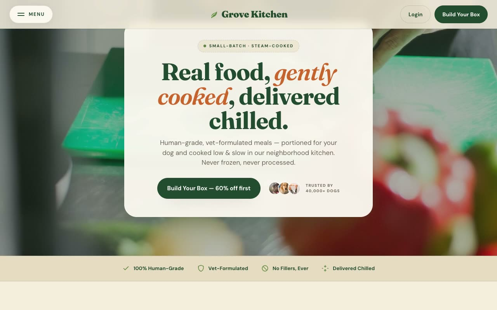

# Grove Kitchen — Fresh Dog Food Brand Landing Page (HTML, CSS, Vanilla JS)

[](./demo.mp4)

A full, multi-section, responsive marketing landing page for a fictional direct-to-consumer fresh dog food brand — "real food, gently cooked, delivered chilled" — built around a warm **Forest Deli** aesthetic: kraft-paper menus, chalkboard signage, and deli-counter warmth rendered in pure HTML, CSS, and vanilla JS with no build step. The page features a cross-fading hero image slider, scroll-reveal animations via IntersectionObserver, a seamless marquee ticker, an FAQ accordion, and a count-up stats band — all on a forest-green and oat-cream palette with Fraunces display serif and DM Sans body type. Generated with Claude Fable 5.

## Run

This is a static project — open `index.html` in a browser, or serve the folder:

```sh
python3 -m http.server 8000
```

See `prompt.md` for the full build spec; `demo.mp4` shows it in motion.

---

Part of the [Landing pages](../) collection in the [claude-directory](../../) — an open-source gallery of AI-generated UI built with Claude Fable 5. [Browse the live gallery](https://pulkitxm.com/claude-directory).
