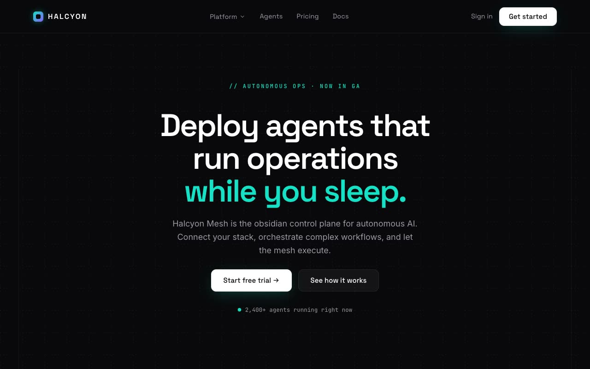

# Halcyon Mesh — Autonomous Ops Control-Plane SaaS Landing Page (HTML, CSS, Vanilla JS)

[](./demo.mp4)

A full, multi-section, responsive marketing landing page for a fictional enterprise autonomous-operations platform — "deploy autonomous agents that run your operations while you sleep" — built with the **Obsidian Control Plane** design language: a deep near-black engineering canvas lit by a single aurora-teal-to-violet glow, faint dashed engineering grid, and a live CSS/SVG dashboard mockup as the hero centerpiece. The page includes a live execution log that appends monospaced lines on a timer, count-up metrics, a cursor-reactive hero glow, a hover-reveal mega-menu, and a company logo marquee — all in pure HTML, CSS, and vanilla JS with Space Grotesk, Inter, and JetBrains Mono fonts vendored locally. Generated with Claude Fable 5.

## Run

This is a static project — open `index.html` in a browser, or serve the folder:

```sh
python3 -m http.server 8000
```

See `prompt.md` for the full build spec; `demo.mp4` shows it in motion.

---

Part of the [Landing pages](../) collection in the [claude-directory](../../) — an open-source gallery of AI-generated UI built with Claude Fable 5. [Browse the live gallery](https://pulkitxm.com/claude-directory).
