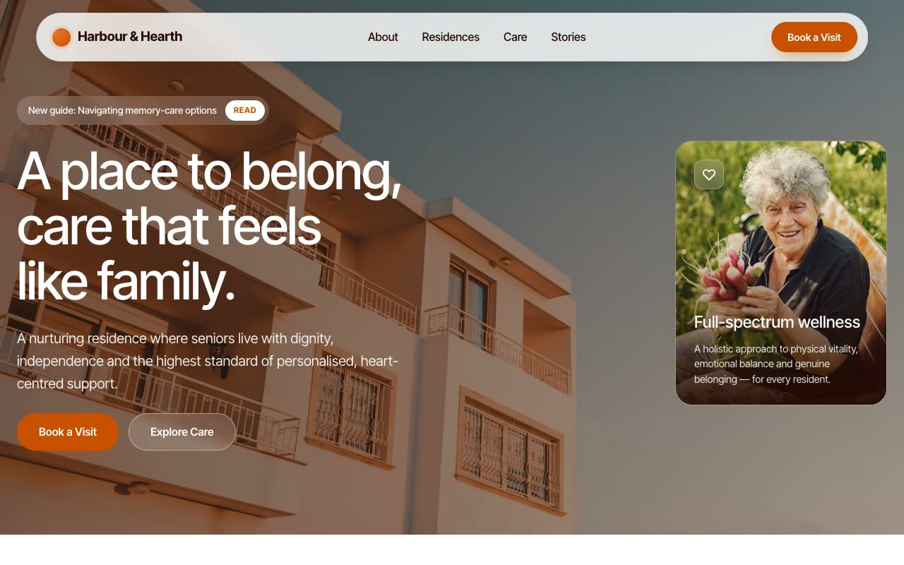

# Harbour & Hearth — Senior Living Community Landing Page (HTML, CSS, Vanilla JS)

[](./demo.mp4)

A full, multi-section, responsive marketing landing page for a fictional high-end senior-living community built around the **Warm Sanctuary** aesthetic — the feeling of a sun-filled Craftsman home at golden hour, pairing clinical expertise with heart-centered compassion on a soft oat-cream canvas with a single burnt-terracotta accent. Sections include a floating pill navbar, a full-viewport hero with a glass feature card, a polaroid-cluster about section, alternating care-service rows, a count-up stats band, a hover-pausing values marquee, a scroll-snap testimonial slider, and a team grid — all in pure HTML, CSS, and vanilla JS with Inter Tight vendored as WOFF2 and all assets local. Generated with Claude Fable 5.

## Run

This is a static project — open `index.html` in a browser, or serve the folder:

```sh
python3 -m http.server 8000
```

See `prompt.md` for the full build spec; `demo.mp4` shows it in motion.

---

Part of the [Landing pages](../) collection in the [claude-directory](../../) — an open-source gallery of AI-generated UI built with Claude Fable 5. [Browse the live gallery](https://pulkitxm.com/claude-directory).
