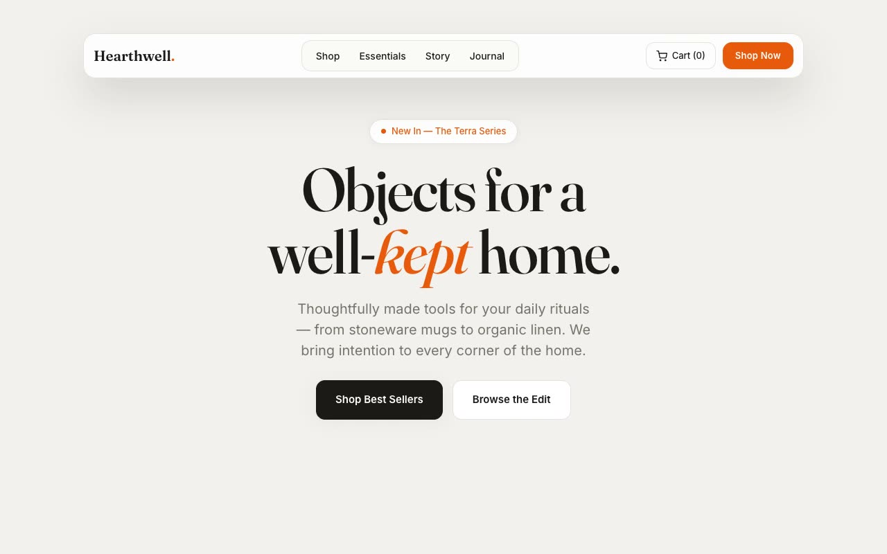

# Hearthwell — Homeware Essentials E-commerce Landing Page (HTML, CSS, Vanilla JS)

[](./demo.mp4)

A full, multi-section, responsive e-commerce landing page for a fictional direct-to-consumer homeware essentials brand — "everyday objects, made to be lived with" — built with the **Marmalade Editorial** design language: a warm boutique-retail aesthetic on soft warm-grey paper with near-black ink and a single saturated marmalade-orange accent used sparingly. Sections include a dismissible announcement bar, a floating pill nav with scroll-tighten behavior, a hero with a 3-slide cross-fade image slider and featured-item overlay card, a marquee trust strip, a collections grid, a bestsellers product grid, a rotating editorial split panel, a testimonial pull-quote band, and a newsletter CTA with inline email validation — all in plain HTML, CSS, and vanilla JS with Fraunces and Inter vendored locally. Generated with Claude Fable 5.

## Run

This is a static project — open `index.html` in a browser, or serve the folder:

```sh
python3 -m http.server 8000
```

See `prompt.md` for the full build spec; `demo.mp4` shows it in motion.

---

Part of the [Landing pages](../) collection in the [claude-directory](../../) — an open-source gallery of AI-generated UI built with Claude Fable 5. [Browse the live gallery](https://pulkitxm.com/claude-directory).
