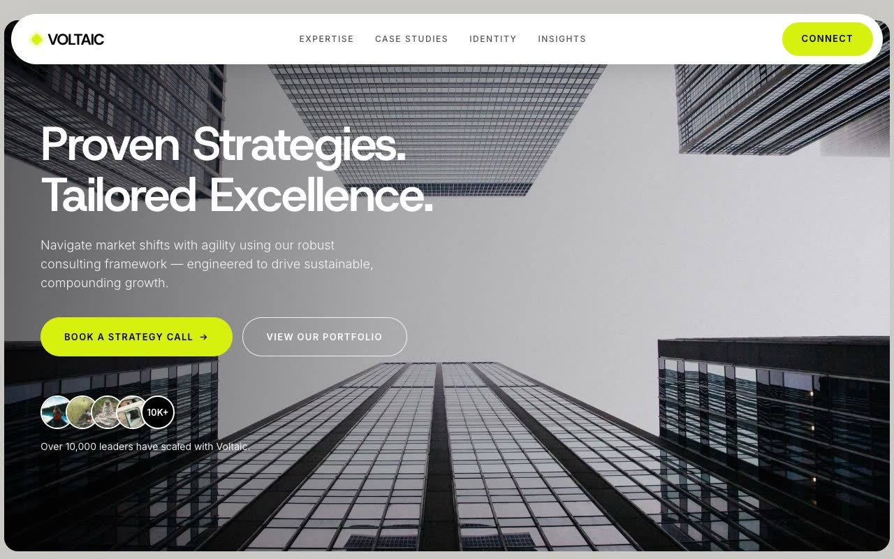

# Helix Strata — Business Architecture & Infrastructure Consultancy Landing Page (HTML, CSS, Vanilla JS)

[](./demo.mp4)

A full, multi-section, responsive marketing landing page for a fictional enterprise business-architecture and infrastructure consultancy — "architecting the future of business" — built with the **Deep-Teal Architectural** design language: alternating deep nocturnal teal and bone-cream sections evoking a premium annual report, with a single periwinkle-lavender accent and editorial Inter typography. Signature features include a hero with two gently floating widget cards that bob on a 6-second animation, an interactive solutions section where hovering a service row cross-fades both the paired image and description text, a testimonial carousel with prev/next fade transitions, and a giant faint wordmark in the footer that brightens to full opacity on hover — all in pure HTML, CSS, and vanilla JS with Inter vendored as WOFF2 and all assets local. Generated with Claude Fable 5.

## Run

This is a static project — open `index.html` in a browser, or serve the folder:

```sh
python3 -m http.server 8000
```

See `prompt.md` for the full build spec; `demo.mp4` shows it in motion.

---

Part of the [Landing pages](../) collection in the [claude-directory](../../) — an open-source gallery of AI-generated UI built with Claude Fable 5. [Browse the live gallery](https://pulkitxm.com/claude-directory).
