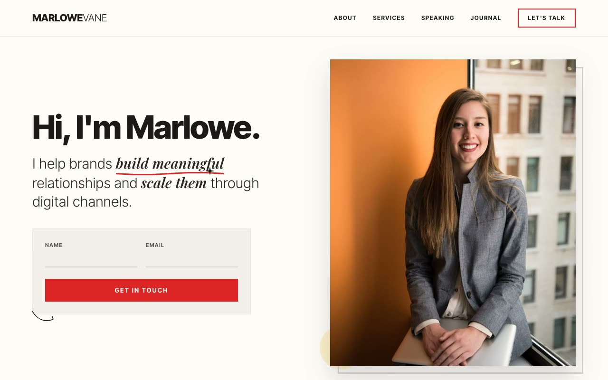

# Ink & Vermilion — Editorial Personal-Brand Landing Page for a Marketing Consultant (Vanilla HTML/CSS/JS)

[](./demo.mp4)

A single-page, fully responsive personal-brand landing page for a fictional independent marketing consultant (Marlowe Vane) built in an "Ink & Vermilion Editorial" design language: warm paper-white canvas, ink-black type, a single decisive vermilion-red accent, and hand-drawn SVG scribbles, underlines, stars, and arrows that give the page a personally-annotated editorial print feel. Eleven sections span a sticky nav, a two-column hero with an inline contact card and portrait paste-up, a seamless marquee strip, a three-column services row, a dark gallery strip, editorial copy rows with hand-drawn node-graph SVGs, a CTA band, a speaking section, a four-up journal grid, a newsletter CTA, and a footer. Vanilla JS drives IntersectionObserver scroll reveals, a CSS-keyframe marquee, a float animation, and grayscale-to-color hover transitions — all respecting `prefers-reduced-motion`. Generated with Claude Fable 5.

## Run

This is a static project — open `index.html` in a browser, or serve the folder:

```sh
python3 -m http.server 8000
```

See `prompt.md` for the full build spec; `demo.mp4` shows it in motion.

---

Part of the [Landing pages](../) collection in the [claude-directory](../../) — an open-source gallery of AI-generated UI built with Claude Fable 5. [Browse the live gallery](https://pulkitxm.com/claude-directory).
