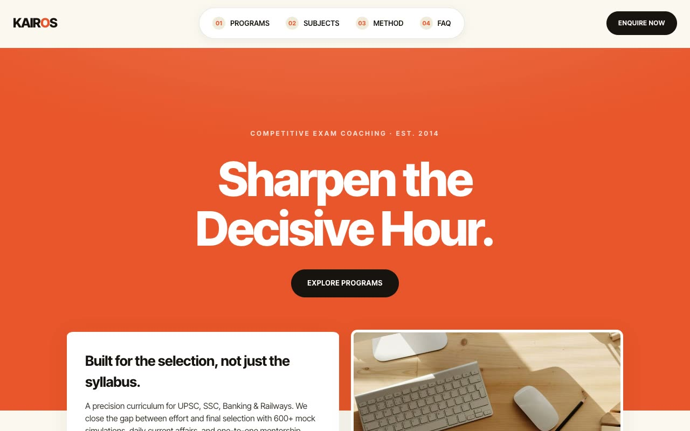

# Kairos Academy — Competitive Exam Coaching Landing Page (Vanilla HTML + CSS + JS)

[](./demo.mp4)

A fully self-contained, responsive marketing landing page for Kairos Academy, a premium competitive-exam coaching institute for civil-service, banking, and railway aspirants. The page uses the "Warm Editorial Ember" aesthetic — a confident, bookish, high-contrast editorial language built on a cream paper stock, one decisive ember-orange accent, ink-black type, and crisp hairline rules punctuated by a small solid dot, evoking a well-printed study annual. The hero uses a signature split-tone layout where an ember upper band gives way to a cream lower band, with overlapping exam cards and floating pill tags above a ghosted "KAIROS" watermark. Sections continue through a count-up stats strip, stacked program rows, a subjects grid, a 4-step Kairos Method grid, auto-rotating testimonials, a single-open FAQ, a CTA bar, and an ink footer. Motion is vanilla JS: per-word hero reveal, IntersectionObserver reveals, floating tags, count-up stats, slide-up double-text nav hovers, and testimonial cross-fade — all respecting `prefers-reduced-motion`. Generated with Claude Fable 5.

## Run

This is a static project — open `index.html` in a browser, or serve the folder:

```sh
python3 -m http.server 8000
```

See `prompt.md` for the full build spec; `demo.mp4` shows it in motion.

---

Part of the [Landing pages](../) collection in the [claude-directory](../../) — an open-source gallery of AI-generated UI built with Claude Fable 5. [Browse the live gallery](https://pulkitxm.com/claude-directory).
