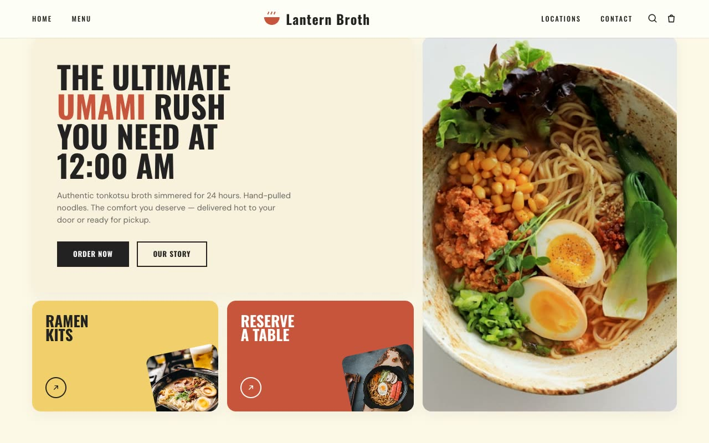

# Lantern Broth — Midnight Ramen Bar Landing Page (Vanilla HTML + CSS Grid + JS)

[](./demo.mp4)

A full, multi-section marketing landing page for Lantern Broth, a late-night Japanese ramen bar. The page uses the "Warm Modular Bento" design language — a cozy, nostalgic, earthy system built entirely from rounded rectangular tiles packed edge-to-edge into a CSS Grid bento-box layout, evoking a tray of neatly arranged dishes. Tile fills alternate between beige, terracotta, mustard, and teal, giving the grid the look of a colorful bento tray. The hero features a two-column bento with a poster headline tile alongside colored action tiles and a tall steaming-bowl photo card. Sections continue through a "made with tradition" feature row, an earthy teal statement band, a top-picks product row, a promo split, a testimonial panel with chevron controls, a WhatsApp rewards CTA, a prep/rewards triptych, and a dark cocoa footer. Motion is vanilla JS: IntersectionObserver tile reveals with stagger, hover de-tilt on hero photos, testimonial rotation, product card lifts, and a drifting steam/glow over the hero bowl — respecting `prefers-reduced-motion`. Typography pairs Oswald (condensed all-caps display) with DM Sans (body), both self-hosted as WOFF2. Generated with Claude Fable 5.

## Run

This is a static project — open `index.html` in a browser, or serve the folder:

```sh
python3 -m http.server 8000
```

See `prompt.md` for the full build spec; `demo.mp4` shows it in motion.

---

Part of the [Landing pages](../) collection in the [claude-directory](../../) — an open-source gallery of AI-generated UI built with Claude Fable 5. [Browse the live gallery](https://pulkitxm.com/claude-directory).
