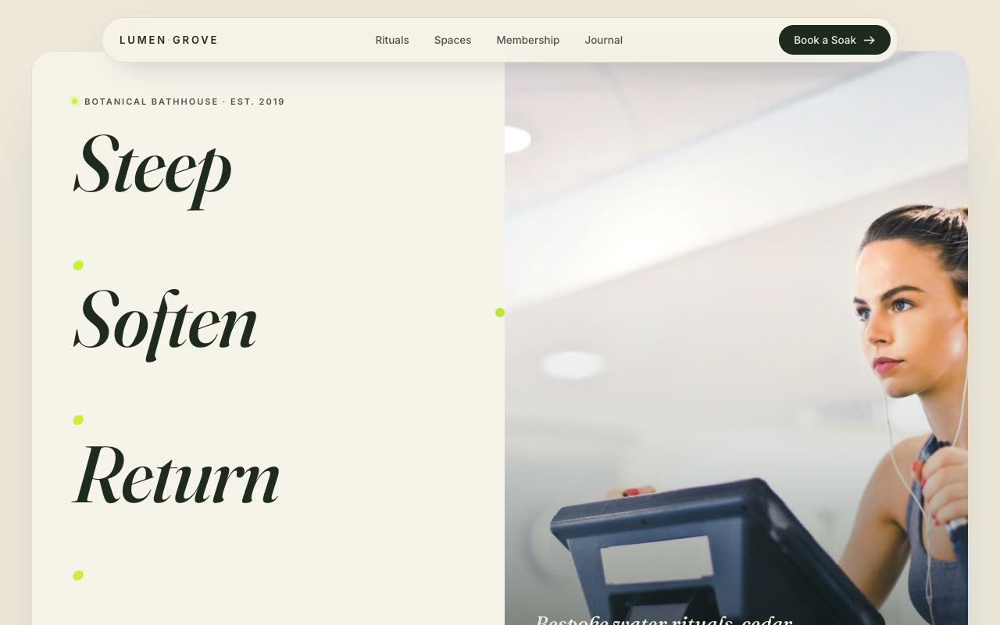

# Lumen Grove — Botanical Bathhouse & Forest-Spa Landing Page (Vanilla HTML + CSS + JS)

[](./demo.mp4)

A full, multi-section, self-contained landing page for Lumen Grove, a fictional botanical bathhouse and forest-spa studio. The page uses the "Verdant Apothecary" aesthetic — a warm, organic, editorial wellness language that feels like a sun-warmed conservatory crossed with a modern herbal apothecary: deep forest-green ink on warm bone paper, punctuated by a single living chartreuse accent. The signature composition is a large rounded "panel-within-a-panel" hero card that floats on the canvas, split between a stacked three-line headline with dual capsule CTAs and a full-bleed photograph. Sections span a floating pill navbar, a rituals intro, a full-bleed marquee gallery, a pathway panel pairing a single-open accordion with a cross-fading image, a full-width testimonial panel, three-card membership pricing (one featured forest-ink card), a newsletter panel, and a footer. Motion is vanilla JS: IntersectionObserver reveals, a trailing chartreuse custom cursor on desktop, a CSS marquee, accordion image cross-fade, and smooth anchor scrolling. Typography pairs Fraunces (display serif) with Inter (body), both vendored locally. Generated with Claude Fable 5.

## Run

This is a static project — open `index.html` in a browser, or serve the folder:

```sh
python3 -m http.server 8000
```

See `prompt.md` for the full build spec; `demo.mp4` shows it in motion.

---

Part of the [Landing pages](../) collection in the [claude-directory](../../) — an open-source gallery of AI-generated UI built with Claude Fable 5. [Browse the live gallery](https://pulkitxm.com/claude-directory).
