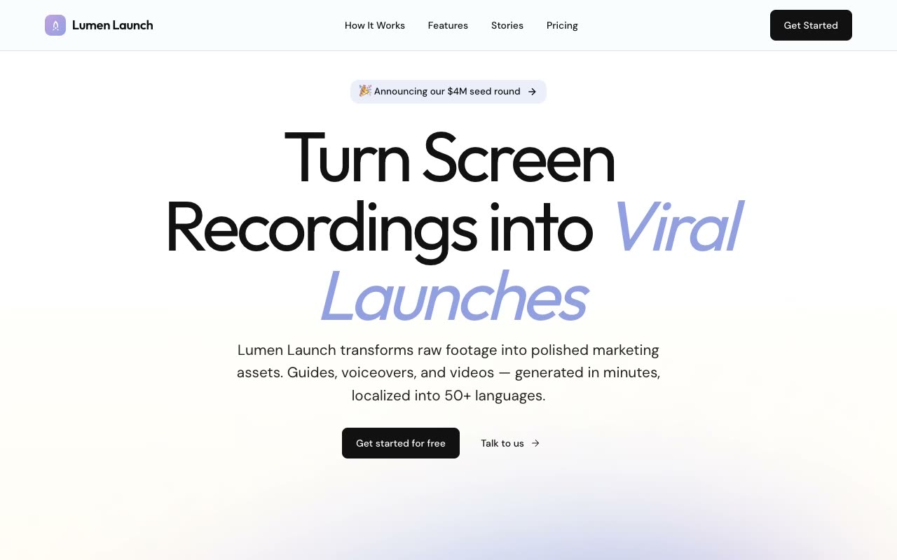

# Lumen Launch — AI SaaS Product Launch Landing Page (Vanilla HTML + CSS + JS)

[](./demo.mp4)

A full, multi-section, responsive landing page for Lumen Launch, a fictional AI SaaS product that turns one screen recording into a full product launch. The page uses the "Periwinkle Aurora" design language — a bright, optimistic modern-SaaS aesthetic built on crisp white paper washed with soft lavender-and-periwinkle aurora gradients, oversized display type, and a single dark "product theatre" section for dramatic contrast. The recurring motif is a large, soft, blurred aurora blob floating behind the hero product mockup — a CSS/SVG browser-chrome dashboard with a video preview card, AI-processing pulse badge, progress bar, language chips, and a 3-step pipeline timeline, all built from HTML + CSS + inline SVG. Sections continue through a logo marquee, a three-step "how it works" row with animated illustrated step cards, alternating feature rows, a dark infinite-scrolling testimonial theatre, a pricing section with a working monthly/yearly toggle, an FAQ accordion, and a CTA band + footer. Motion is vanilla JS respecting `prefers-reduced-motion`. Typography pairs Outfit (display) with DM Sans (body), both vendored locally. Generated with Claude Fable 5.

## Run

This is a static project — open `index.html` in a browser, or serve the folder:

```sh
python3 -m http.server 8000
```

See `prompt.md` for the full build spec; `demo.mp4` shows it in motion.

---

Part of the [Landing pages](../) collection in the [claude-directory](../../) — an open-source gallery of AI-generated UI built with Claude Fable 5. [Browse the live gallery](https://pulkitxm.com/claude-directory).
