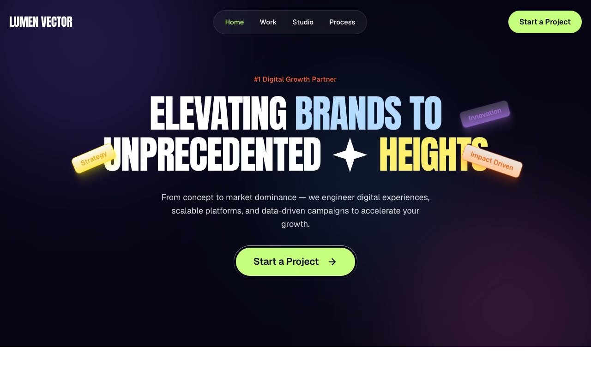

# Lumen Vector — Electric Brutalism Creative Agency Landing Page (Vanilla HTML + CSS + JS)

[](./demo.mp4)

A fully responsive, multi-section creative-agency landing page for Lumen Vector, built in the "Electric Brutalism" design language. The mood is loud, confident, and playful — a deep midnight-indigo hero that explodes into a bright-white body drenched in candy-pastel panels, with oversized condensed poster typography (Anton), electric-lime accents, floating glossy pill particles, and crisp micro-interactions. Sections span an absolute header over the dark hero with a glass-pill desktop nav, a full-viewport hero with mixed-color headline words and floating tag pills, a trust marquee, a six-card pastel services grid, a studio/about block, a stacked selected-work gallery, a scroll-linked parallax testimonial row, a blue-panel pricing section, a two-column FAQ accordion, a methodology deck where three cards fan out on scroll into view, and a dark footer. Motion is vanilla JS: IntersectionObserver reveals, floating-pill loops, the marquee, scroll-mapped testimonial parallax, the methodology fan, a scroll-triggered header backdrop, and hover wipe-fills — respecting `prefers-reduced-motion`. Typography pairs Anton (condensed poster display) with Geist (body), both vendored locally. Generated with Claude Fable 5.

## Run

This is a static project — open `index.html` in a browser, or serve the folder:

```sh
python3 -m http.server 8000
```

See `prompt.md` for the full build spec; `demo.mp4` shows it in motion.

---

Part of the [Landing pages](../) collection in the [claude-directory](../../) — an open-source gallery of AI-generated UI built with Claude Fable 5. [Browse the live gallery](https://pulkitxm.com/claude-directory).
