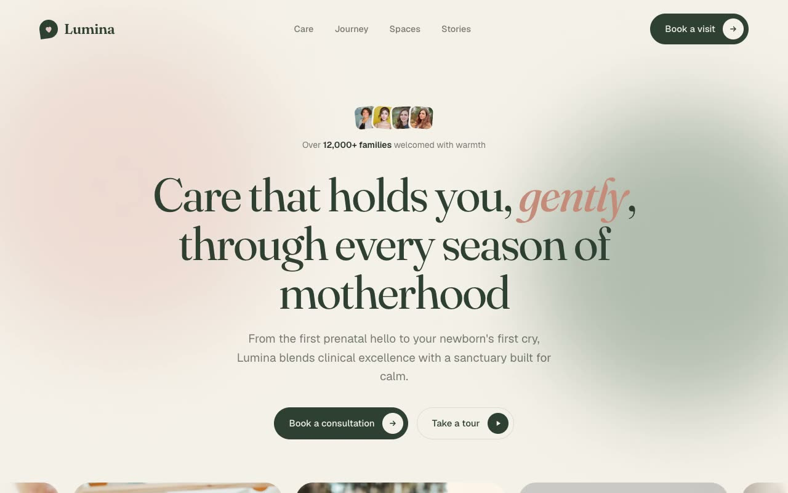

# Lumina Maternité — Premium Maternity & Women's Health Landing Page (Vanilla HTML + CSS + JS)

[](./demo.mp4)

A single, self-contained, responsive landing page for Lumina Maternité, a premium maternity and women's health sanctuary. The page uses the "Quiet Sanctuary" aesthetic — a soft, editorial, organic-modern design language with generous whitespace, rounded organic shapes, subtle grain, and deep moss-green accents against a bone-white canvas with warm blush highlights. The hero features drifting blurred organic blobs and a hover-pausing image-card marquee; subsequent sections include a moss ticker strip, a care/specialties grid, a sticky-stacking "journey" scroll section, an interactive packages section where selecting a plan swaps the left detail panel via JS, a reverse-scrolling assurance strip, an about/facility split, a masonry stories grid, a single-open FAQ, a contact/booking form with an inline success state, and a footer. Motion is all vanilla JS respecting `prefers-reduced-motion`. Typography pairs Fraunces (display serif, italic emphasis) with Geist (body), both vendored locally as WOFF2. Generated with Claude Fable 5.

## Run

This is a static project — open `index.html` in a browser, or serve the folder:

```sh
python3 -m http.server 8000
```

See `prompt.md` for the full build spec; `demo.mp4` shows it in motion.

---

Part of the [Landing pages](../) collection in the [claude-directory](../../) — an open-source gallery of AI-generated UI built with Claude Fable 5. [Browse the live gallery](https://pulkitxm.com/claude-directory).
