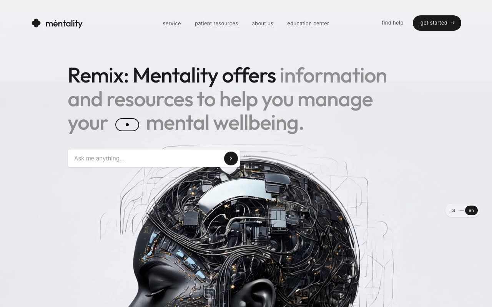

# mėntality — Cinematic Mental-Health Hero Landing Page (React + Vite + Tailwind CSS + Motion)

[](./demo.mp4)

A cinematic, single-section landing hero for mėntality, a fictional mental-health resources product. The page pairs a full-bleed background video that gradient-masks into a soft `#edeef5` base with a glassmorphic, fixed navigation bar, built in React 19 + Vite and animated with Motion (formerly Framer Motion). Notable techniques include `backdrop-blur` glassmorphism, a gradient mask that blends the video top into the base color, `clamp()` fluid headline sizing, an animated SVG hamburger that morphs into an X, an inline blinking "eye/pupil" pill in the headline, and an animated `pl`/`en` language toggle. Styling is Tailwind CSS 4 via the `@tailwindcss/vite` plugin (CSS-first `@theme`, no config file), with Inter and Outfit from Google Fonts. Generated with Claude Fable 5.

## Run

```sh
npm install
npm run dev      # Vite dev server
npm run build    # tsc --noEmit && vite build
npm run preview  # preview the production build
```

See `prompt.md` for the full build spec; `demo.mp4` shows it in motion.

---

Part of the [Landing pages](../) collection in the [claude-directory](../../) — an open-source gallery of AI-generated UI built with Claude Fable 5. [Browse the live gallery](https://pulkitxm.com/claude-directory).
