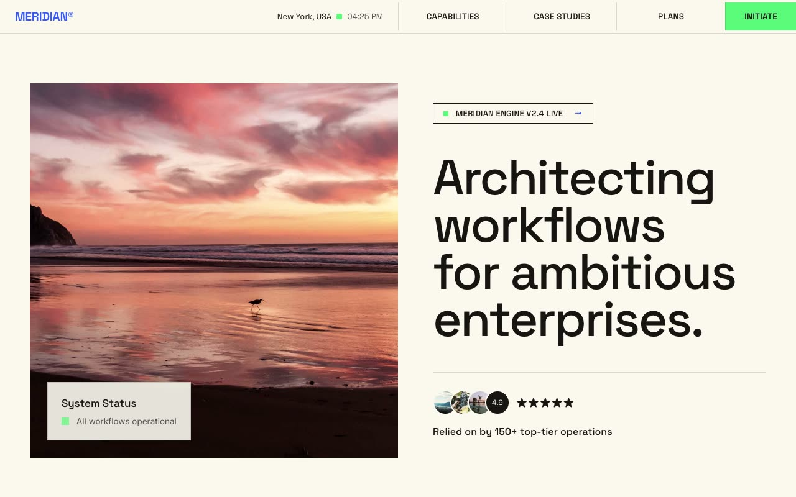

# Meridian Grid Systems — Warm Brutalist Automation Landing Page (Vanilla HTML/CSS/JS)

[](./demo.mp4)

A multi-section marketing landing page for Meridian®, a fictional intelligent-automation consultancy, built on a "Warm Brutalist Grid" design language — a Swiss/editorial poster system on a warm paper-cream canvas, structured entirely by 1px hairline rules and hard rectangular panels with zero border radius and flat blocks of electric green and cobalt blue. The page flows through a live-clock sticky navbar, a 50/50 split hero, a statement band, a seamless logo marquee, about grid, count-up stats strip, staggered process cards, a pricing table with monthly/annual toggle, a hard-offset-shadow contact form, and footer — all self-contained with no runtime CDN dependencies and `prefers-reduced-motion` support. Generated with Claude Fable 5.

## Run

This is a static project — open `index.html` in a browser, or serve the folder:

```sh
python3 -m http.server 8000
```

See `prompt.md` for the full build spec; `demo.mp4` shows it in motion.

---

Part of the [Landing pages](../) collection in the [claude-directory](../../) — an open-source gallery of AI-generated UI built with Claude Fable 5. [Browse the live gallery](https://pulkitxm.com/claude-directory).
