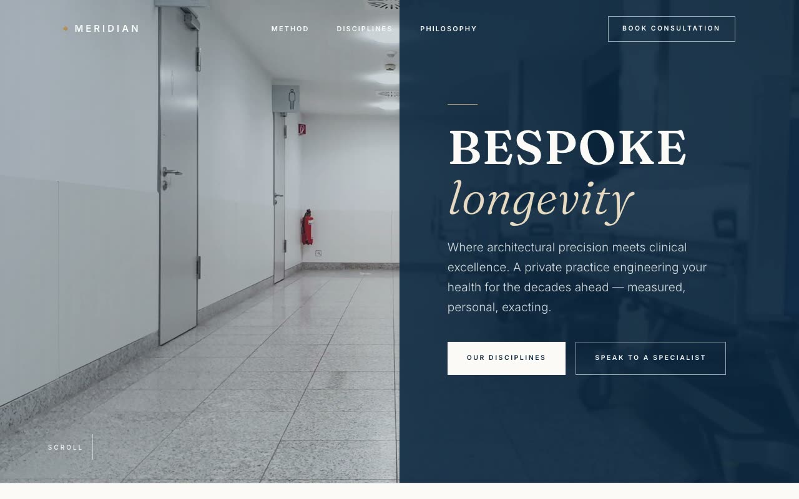

# Meridian Precision Clinic — Architectural Clinical Editorial Landing Page (Vanilla HTML/CSS/JS)

[](./demo.mp4)

A single-page landing site for Meridian, a fictional bespoke precision-medicine clinic for longevity and executive health, styled in an "Architectural Clinical Editorial" aesthetic — the restrained luxury of a high-end architecture monograph fused with the precision of a medical journal, rendered in deep navy and warm bone with whisper-quiet brass accents. Sections include a transparent-to-solid fixed header, a split full-viewport hero with a navy panel that slides in on load, a credentials marquee, a split philosophy editorial, a hairline discipline grid, a numbered method process, a deep-navy contact form, and footer — all hairline-divided, flat, sharp-cornered, and self-contained. Generated with Claude Fable 5.

## Run

This is a static project — open `index.html` in a browser, or serve the folder:

```sh
python3 -m http.server 8000
```

See `prompt.md` for the full build spec; `demo.mp4` shows it in motion.

---

Part of the [Landing pages](../) collection in the [claude-directory](../../) — an open-source gallery of AI-generated UI built with Claude Fable 5. [Browse the live gallery](https://pulkitxm.com/claude-directory).
