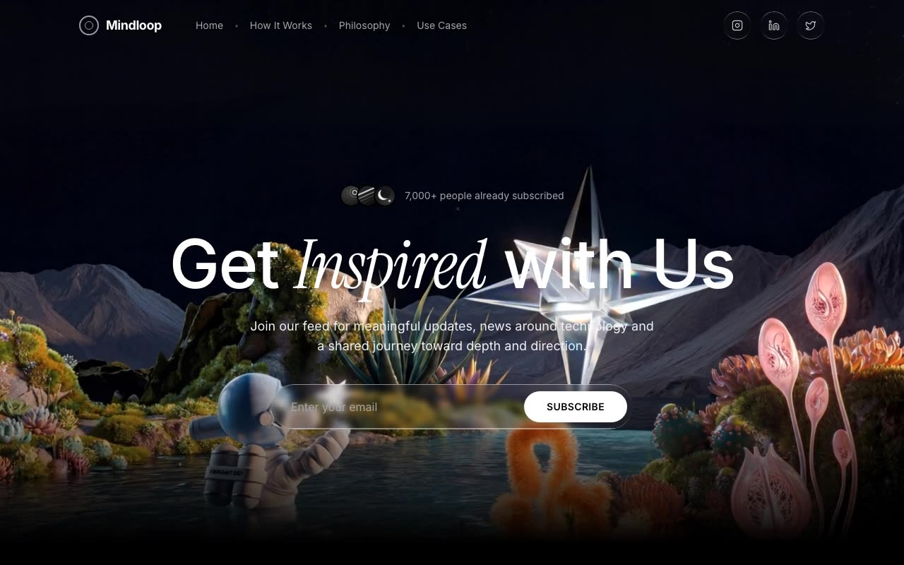

# Mindloop — Dark Monochrome Newsletter Landing Page (React + Vite + Tailwind CSS + Framer Motion)

[](./demo.mp4)

A pure-black (#000) monochrome landing page for Mindloop, a newsletter and content platform, where white typography does the talking — Inter for structure and Instrument Serif italics for accent words. The seven-section page flows through a fixed glass navbar, a full-viewport MP4 hero with email capture, an AI-platform awareness section, a scroll-driven word-by-word opacity reveal, a solution feature grid with a 3:1 video panel, an HLS-streamed CTA section via hls.js (with native Safari fallback), and a minimal footer — with Framer Motion entrances and a liquid-glass CSS border effect throughout. Generated with Claude Fable 5.

## Stack

- React 18 + Vite 5 + TypeScript
- Tailwind CSS 3 + tailwindcss-animate + shadcn/ui primitives
- Framer Motion (entrances, scroll-driven word reveal, micro-interactions)
- hls.js (lazy-loaded) for the HLS background video in the CTA section
- @fontsource/inter + @fontsource/instrument-serif
- lucide-react icons

## Page anatomy

1. **Navbar** — fixed/transparent; concentric-circles logo, dot-separated links, liquid-glass social buttons
2. **Hero** — full-viewport MP4 background, avatar social proof, serif-italic headline, liquid-glass email capture
3. **Search has changed** — ChatGPT / Perplexity / Google AI platform cards
4. **Mission** — 800×800 looping video + scroll-driven word-by-word opacity reveal (`useScroll` + `useTransform`)
5. **Solution** — 3:1 video panel + 4-column feature grid
6. **CTA** — HLS background video via hls.js (native HLS fallback for Safari), dual CTAs
7. **Footer**

## Develop

```bash
npm install
npm run dev      # local dev server
npm run build    # type-check + production build
npm run preview  # serve the production build
npm run assets   # regenerate monochrome avatars/platform icons (sharp + simple-icons)
```

The PNG assets in `src/assets/` are generated by `scripts/generate-assets.mjs` —
abstract grayscale avatars and white brand marks in faint glass squircles.

---

Part of the [Landing pages](../) collection in the [claude-directory](../../) — an open-source gallery of AI-generated UI built with Claude Fable 5. [Browse the live gallery](https://pulkitxm.com/claude-directory).
