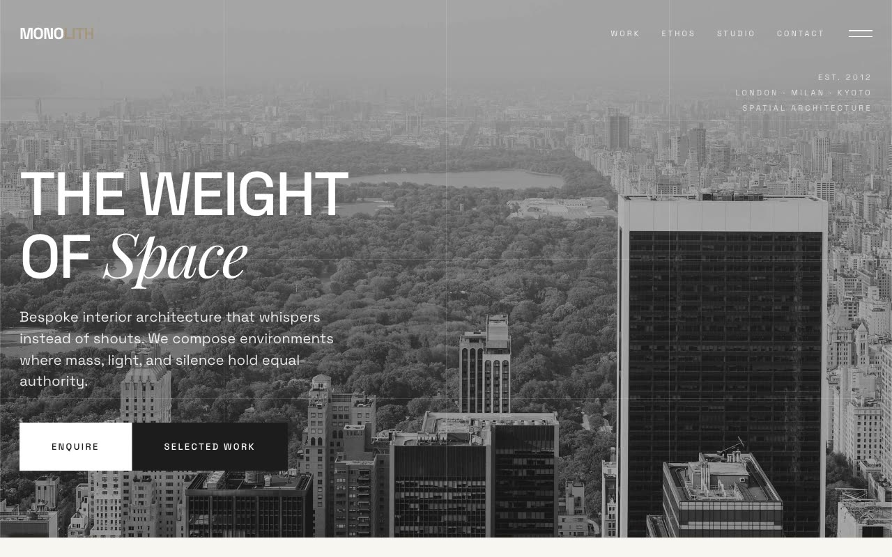

# Monolith Grid Atelier — Swiss-Modernist Interior Architecture Studio Landing Page (Vanilla HTML/CSS/JS)

[](./demo.mp4)

A multi-section landing page for Monolith, a fictional high-end interior-architecture studio, built on a "Grid Monument" design language — a Swiss-modernist, architect's-drawing aesthetic ruled by a visible structural grid in bone-white, near-black ink, and a single warm taupe/sandstone accent, everything flat and hairline-divided. Sections include a `mix-blend-mode: difference` fixed header with a full-screen overlay menu, a full-viewport hero with a structural grid overlay, an ethos/stats modular grid with a rotating SVG text seal, a 3-column grid of 3D flip cards, a foundation feature panel, a contact form with an animated submit state, and footer — all self-contained and offline-runnable with `prefers-reduced-motion` support. Generated with Claude Fable 5.

## Run

This is a static project — open `index.html` in a browser, or serve the folder:

```sh
python3 -m http.server 8000
```

See `prompt.md` for the full build spec; `demo.mp4` shows it in motion.

---

Part of the [Landing pages](../) collection in the [claude-directory](../../) — an open-source gallery of AI-generated UI built with Claude Fable 5. [Browse the live gallery](https://pulkitxm.com/claude-directory).
