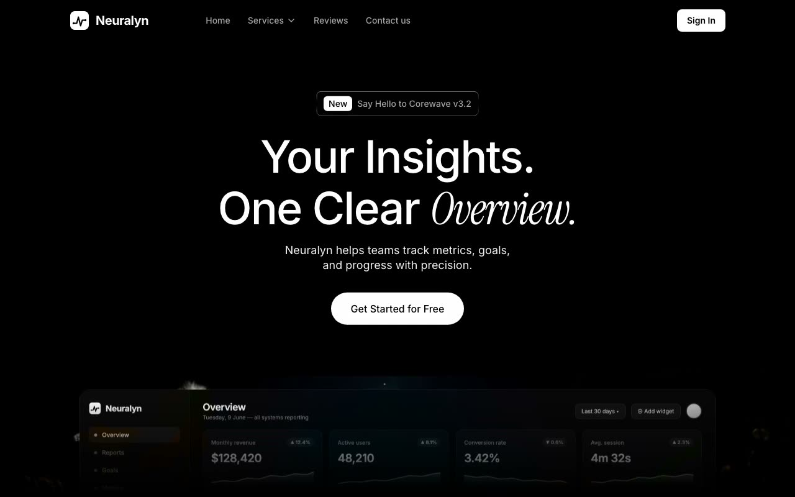

# Neuralyn — Dark Analytics SaaS Landing Page (React + Vite + TypeScript + Framer Motion)

[](./demo.mp4)

A dark, full-bleed landing page for Neuralyn, a fictional analytics-dashboard SaaS, featuring a full-viewport hero with a scroll-linked parallax dashboard composited over a looping background video and a scroll-driven testimonial where each word lights up as you scroll. The aesthetic is pure-black background, white type, a single italic serif accent word, and a liquid-glass tag pill. Built with React 18 + Vite and TypeScript, styled with Tailwind CSS 3 and shadcn/ui-style primitives, animated via Framer Motion (`useScroll`/`useTransform`) for scroll-linked parallax and the word-by-word color reveal, with fonts self-hosted via Fontsource. Generated with Claude Fable 5.

## Run

```sh
npm install
npm run dev      # Vite dev server
npm run build    # tsc --noEmit && vite build
npm run preview  # preview the production build
npm run assets   # node scripts/generate-assets.mjs
npm run verify   # node scripts/verify.mjs
```

See `prompt.md` for the full build spec; `demo.mp4` shows it in motion.

---

Part of the [Landing pages](../) collection in the [claude-directory](../../) — an open-source gallery of AI-generated UI built with Claude Fable 5. [Browse the live gallery](https://pulkitxm.com/claude-directory).
