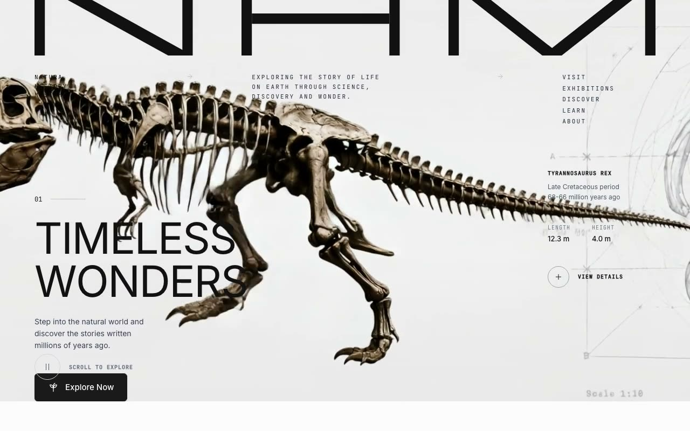

# NHM Paleontology — Natural History Museum Monochrome Landing Page (React 19 + Vite + Tailwind CSS 4 + Motion)

[](./demo.mp4)

A monochrome, editorial landing page for a fictional Natural History Museum paleontology collection, featuring a three-section continuous scroll: a full-viewport hero with a delayed background video reveal and an animated geometric "NHM" SVG logotype (per-polygon slide-up reveal), an "Explore Our World" section with scroll-revealed display heading and action pills, and a dark "Ancient Collection" chapter browser with auto-cycling fossil images and a custom SVG `feTurbulence`/`feDisplacementMap` sand-dissolve transition effect. Built with React 19, Vite 6, Tailwind CSS 4 (CSS-first config), and Motion (Framer Motion), in a strictly monochrome black/white/gray palette — no color accents. Generated with Claude Fable 5.

## Run

```sh
npm install
npm run dev       # dev server
npm run build     # type-check + production build
npm run preview   # serve dist/
```

## Verify (CLI, headless)

```sh
npm run build && npm run preview -- --port 4185 --strictPort &
node scripts/verify.mjs            # 49 DOM/behavior checks, desktop + mobile
```

`scripts/verify.mjs` needs `playwright` resolvable (install it in this project
or in a sibling project of this repo).

---

Part of the [Landing pages](../) collection in the [claude-directory](../../) — an open-source gallery of AI-generated UI built with Claude Fable 5. [Browse the live gallery](https://pulkitxm.com/claude-directory).
