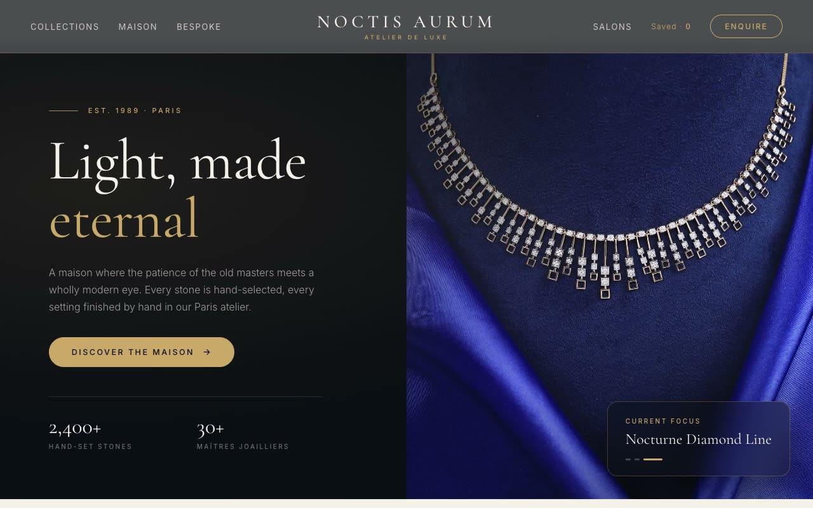

# Noctis Aurum — Fine Jewelry Maison E-Commerce Landing Page (Vanilla HTML/CSS/JS)

[](./demo.mp4)

A multi-section e-commerce landing page for Noctis Aurum, a fictional fine-jewelry maison (atelier de luxe, est. 1989), built on an "Obsidian & Champagne" aesthetic — a deep, nocturnal, old-money luxury language where champagne gold glints against ink-dark obsidian and cool pearl, with Cormorant Garamond serif headlines and generous negative space. Sections flow from an announcement banner and sticky blurred header through a split hero with a 3-image cross-fade slideshow and floating "current focus" card, a circular category rail, a gold marquee strip, an 8-product grid with quick-add simulation, a dark heritage feature, a men's 3-card strip, a bespoke atelier block, and footer — all self-contained and offline-runnable with `prefers-reduced-motion` support. Generated with Claude Fable 5.

## Run

This is a static project — open `index.html` in a browser, or serve the folder:

```sh
python3 -m http.server 8000
```

See `prompt.md` for the full build spec; `demo.mp4` shows it in motion.

---

Part of the [Landing pages](../) collection in the [claude-directory](../../) — an open-source gallery of AI-generated UI built with Claude Fable 5. [Browse the live gallery](https://pulkitxm.com/claude-directory).
